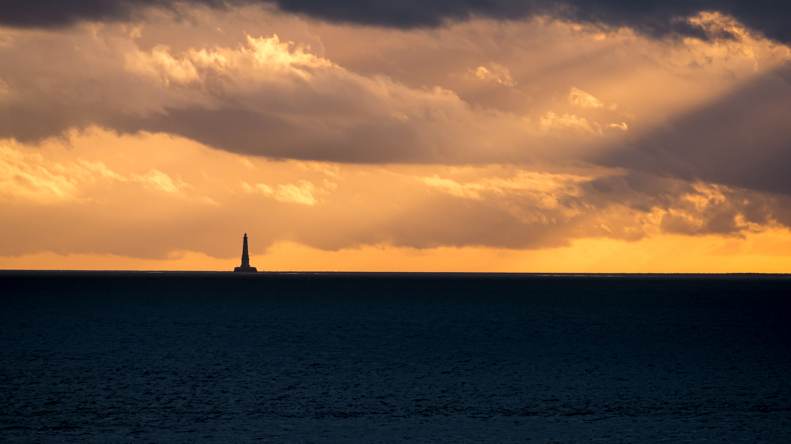

```json
{
  "images": [
    {
      "startdate": "20230509",
      "fullstartdate": "202305091600",
      "enddate": "20230510",
      "url": "/th?id=OHR.CordouanLighthouse_ZH-CN6267155218_UHD.jpg&rf=LaDigue_UHD.jpg&pid=hp&w=3840&h=2160&rs=1&c=4",
      "urlbase": "/th?id=OHR.CordouanLighthouse_ZH-CN6267155218",
      "copyright": "科尔杜昂灯塔，罗扬市，夏朗德省，法国 (© FRTimelapse/Getty Images)",
      "copyrightlink": "/search?q=%e7%a7%91%e5%b0%94%e6%9d%9c%e6%98%82%e7%81%af%e5%a1%94&form=hpcapt&mkt=zh-cn",
      "title": "金光中的灯塔",
      "quiz": "/search?q=Bing+homepage+quiz&filters=WQOskey:%22HPQuiz_20230509_CordouanLighthouse%22&FORM=HPQUIZ",
      "wp": true,
      "hsh": "bacc4e0ac04e2181493cc930dd9b2e1e",
      "drk": 1,
      "top": 1,
      "bot": 1,
      "hs": []
    }
  ],
  "tooltips": {
    "loading": "正在加载...",
    "previous": "上一个图像",
    "next": "下一个图像",
    "walle": "此图片不能下载用作壁纸。",
    "walls": "下载今日美图。仅限用作桌面壁纸。"
  }
}
```
