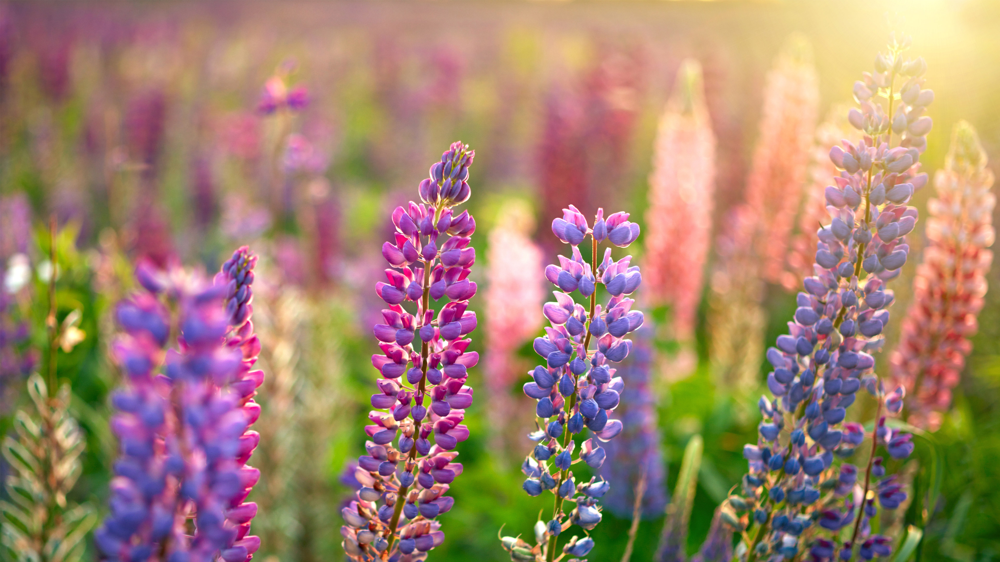

```json
{
  "images": [
    {
      "startdate": "20230511",
      "fullstartdate": "202305111600",
      "enddate": "20230512",
      "url": "/th?id=OHR.WildLupine_ZH-CN6623952879_UHD.jpg&rf=LaDigue_UHD.jpg&pid=hp&w=3840&h=2160&rs=1&c=4",
      "urlbase": "/th?id=OHR.WildLupine_ZH-CN6623952879",
      "copyright": "紫色和蓝色的野生羽扇豆 (© silverjohn/Getty Images Plus)",
      "copyrightlink": "/search?q=%e9%87%8e%e7%94%9f%e7%be%bd%e6%89%87%e8%b1%86&form=hpcapt&mkt=zh-cn",
      "title": "蝴蝶最好的朋友",
      "quiz": "/search?q=Bing+homepage+quiz&filters=WQOskey:%22HPQuiz_20230511_WildLupine%22&FORM=HPQUIZ",
      "wp": true,
      "hsh": "542dabd461458081927ad4a32019e92d",
      "drk": 1,
      "top": 1,
      "bot": 1,
      "hs": []
    }
  ],
  "tooltips": {
    "loading": "正在加载...",
    "previous": "上一个图像",
    "next": "下一个图像",
    "walle": "此图片不能下载用作壁纸。",
    "walls": "下载今日美图。仅限用作桌面壁纸。"
  }
}
```
