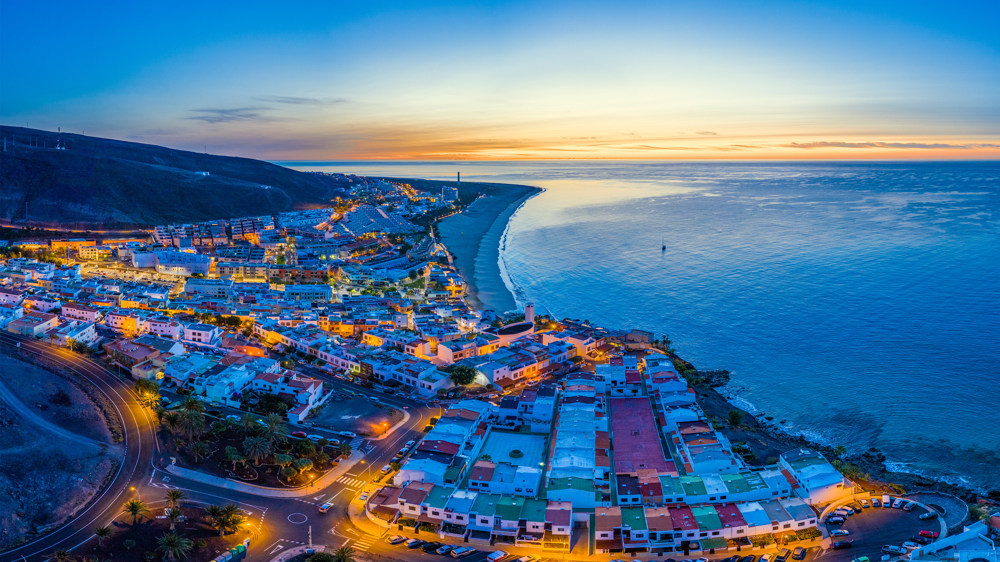

```json
{
  "images": [
    {
      "startdate": "20230514",
      "fullstartdate": "202305141600",
      "enddate": "20230515",
      "url": "/th?id=OHR.MorroJable_ZH-CN7382027688_UHD.jpg&rf=LaDigue_UHD.jpg&pid=hp&w=3840&h=2160&rs=1&c=4",
      "urlbase": "/th?id=OHR.MorroJable_ZH-CN7382027688",
      "copyright": "莫罗哈夫莱海滩和科罗拉达斯海滩，富埃特文图拉岛，西班牙加那利群岛 (© Gavin Hellier/Getty Images)",
      "copyrightlink": "/search?q=%e5%8a%a0%e9%82%a3%e5%88%a9%e7%be%a4%e5%b2%9b&form=hpcapt&mkt=zh-cn",
      "title": "文化交汇的岛屿",
      "quiz": "/search?q=Bing+homepage+quiz&filters=WQOskey:%22HPQuiz_20230514_MorroJable%22&FORM=HPQUIZ",
      "wp": true,
      "hsh": "3c23645b249ed6059ff05f854976b7b1",
      "drk": 1,
      "top": 1,
      "bot": 1,
      "hs": []
    }
  ],
  "tooltips": {
    "loading": "正在加载...",
    "previous": "上一个图像",
    "next": "下一个图像",
    "walle": "此图片不能下载用作壁纸。",
    "walls": "下载今日美图。仅限用作桌面壁纸。"
  }
}
```
