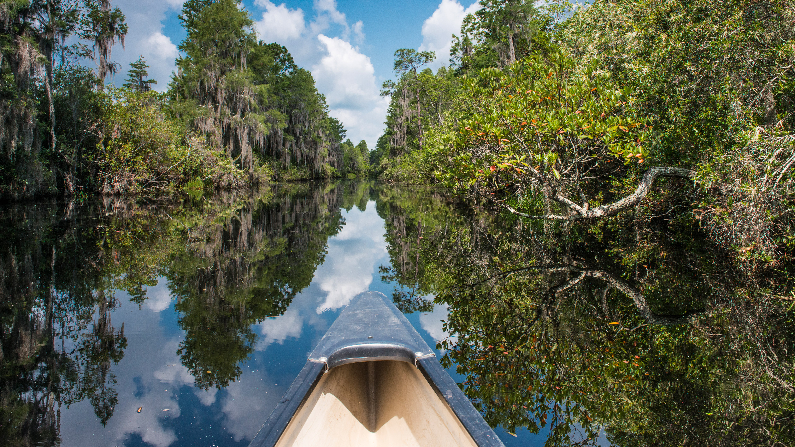

```json
{
  "images": [
    {
      "startdate": "20230515",
      "fullstartdate": "202305151600",
      "enddate": "20230516",
      "url": "/th?id=OHR.AmericanWetlands_ZH-CN7534567518_UHD.jpg&rf=LaDigue_UHD.jpg&pid=hp&w=3840&h=2160&rs=1&c=4",
      "urlbase": "/th?id=OHR.AmericanWetlands_ZH-CN7534567518",
      "copyright": "在奥克弗诺基国家野生动物保护区划独木舟 (© Brad Beck/Tandem Stills + Motion)",
      "copyrightlink": "/search?q=%e5%a5%a5%e5%85%8b%e5%bc%97%e8%af%ba%e5%9f%ba%e5%9b%bd%e5%ae%b6%e9%87%8e%e7%94%9f%e5%8a%a8%e7%89%a9%e4%bf%9d%e6%8a%a4%e5%8c%ba&form=hpcapt&mkt=zh-cn",
      "title": "一片平静的水域",
      "quiz": "/search?q=Bing+homepage+quiz&filters=WQOskey:%22HPQuiz_20230515_AmericanWetlands%22&FORM=HPQUIZ",
      "wp": true,
      "hsh": "3ce7abd94c58a13230b6ac24d916aef2",
      "drk": 1,
      "top": 1,
      "bot": 1,
      "hs": []
    }
  ],
  "tooltips": {
    "loading": "正在加载...",
    "previous": "上一个图像",
    "next": "下一个图像",
    "walle": "此图片不能下载用作壁纸。",
    "walls": "下载今日美图。仅限用作桌面壁纸。"
  }
}
```
