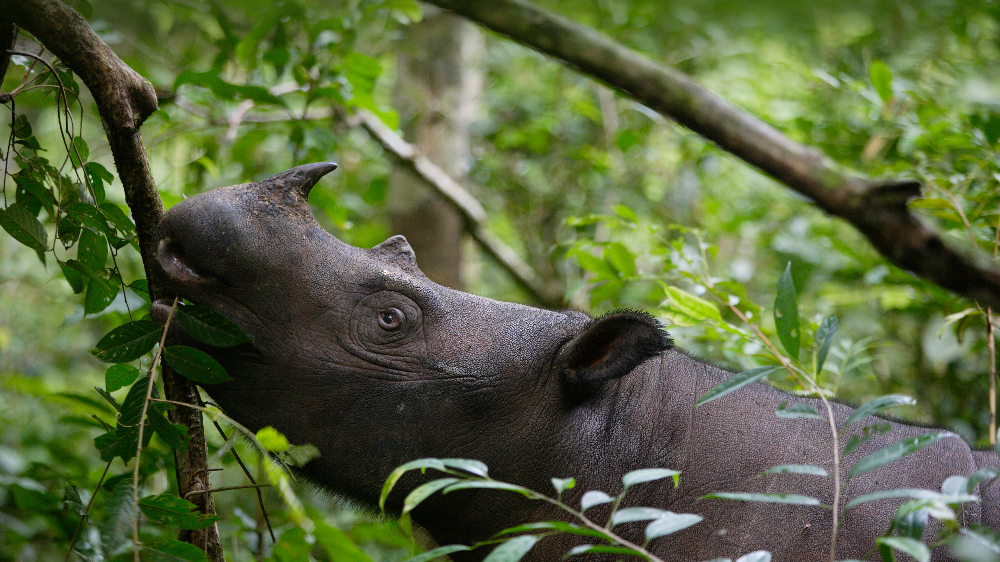

```json
{
  "images": [
    {
      "startdate": "20230518",
      "fullstartdate": "202305181600",
      "enddate": "20230519",
      "url": "/th?id=OHR.SumatranRhino_ZH-CN4529744910_UHD.jpg&rf=LaDigue_UHD.jpg&pid=hp&w=3840&h=2160&rs=1&c=4",
      "urlbase": "/th?id=OHR.SumatranRhino_ZH-CN4529744910",
      "copyright": "苏门答腊犀牛，韦卡巴斯国家公园，印度尼西亚 (© Cyril Ruoso/Minden Pictures)",
      "copyrightlink": "/search?q=%e8%8b%8f%e9%97%a8%e7%ad%94%e8%85%8a%e7%8a%80%e7%89%9b&form=hpcapt&mkt=zh-cn",
      "title": "我们怎么才能帮助濒危动物？",
      "quiz": "/search?q=Bing+homepage+quiz&filters=WQOskey:%22HPQuiz_20230518_SumatranRhino%22&FORM=HPQUIZ",
      "wp": true,
      "hsh": "35705d4d406771e5eba5fb67e2ecc382",
      "drk": 1,
      "top": 1,
      "bot": 1,
      "hs": []
    }
  ],
  "tooltips": {
    "loading": "正在加载...",
    "previous": "上一个图像",
    "next": "下一个图像",
    "walle": "此图片不能下载用作壁纸。",
    "walls": "下载今日美图。仅限用作桌面壁纸。"
  }
}
```
