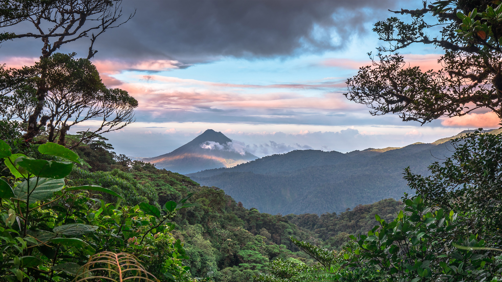

```json
{
  "images": [
    {
      "startdate": "20230521",
      "fullstartdate": "202305211600",
      "enddate": "20230522",
      "url": "/th?id=OHR.BiodiverseCostaRica_ZH-CN5524154131_UHD.jpg&rf=LaDigue_UHD.jpg&pid=hp&w=3840&h=2160&rs=1&c=4",
      "urlbase": "/th?id=OHR.BiodiverseCostaRica_ZH-CN5524154131",
      "copyright": "阿雷纳尔火山，蒙泰韦尔德，哥斯达黎加 (© Kevin Wells/Getty Images)",
      "copyrightlink": "/search?q=%e5%93%a5%e6%96%af%e8%be%be%e9%bb%8e%e5%8a%a0+%e8%92%99%e6%b3%b0%e9%9f%a6%e5%b0%94%e5%be%b7&form=hpcapt&mkt=zh-cn",
      "title": "为了每个人，保护地球的生物多样性",
      "quiz": "/search?q=Bing+homepage+quiz&filters=WQOskey:%22HPQuiz_20230521_BiodiverseCostaRica%22&FORM=HPQUIZ",
      "wp": true,
      "hsh": "59bcdfb04510a9570e60252bc3e25b54",
      "drk": 1,
      "top": 1,
      "bot": 1,
      "hs": []
    }
  ],
  "tooltips": {
    "loading": "正在加载...",
    "previous": "上一个图像",
    "next": "下一个图像",
    "walle": "此图片不能下载用作壁纸。",
    "walls": "下载今日美图。仅限用作桌面壁纸。"
  }
}
```
