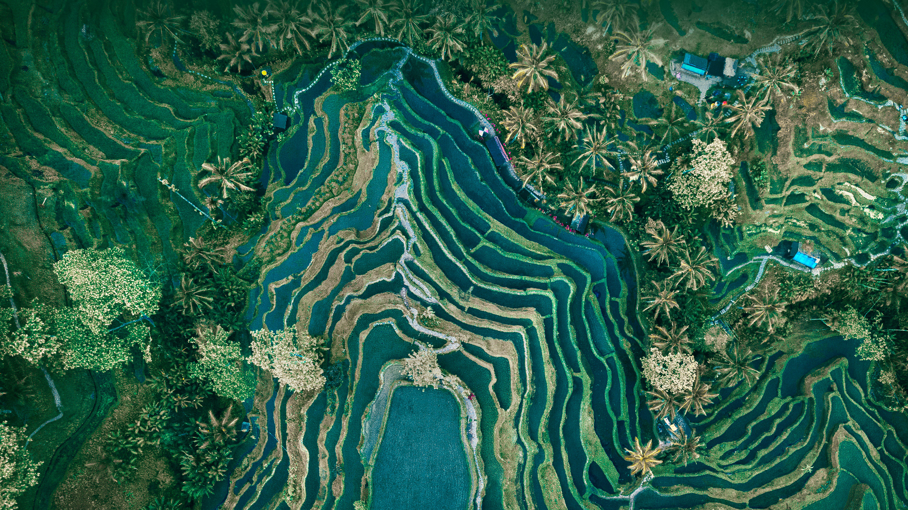

```json
{
  "images": [
    {
      "startdate": "20230527",
      "fullstartdate": "202305271600",
      "enddate": "20230528",
      "url": "/th?id=OHR.TegallalangTerrace_ZH-CN8126456968_UHD.jpg&rf=LaDigue_UHD.jpg&pid=hp&w=3840&h=2160&rs=1&c=4",
      "urlbase": "/th?id=OHR.TegallalangTerrace_ZH-CN8126456968",
      "copyright": "乌布的德格拉朗梯田，印度尼西亚 (© Cavan Images/Adobe Stock)",
      "copyrightlink": "/search?q=%e5%8d%b0%e5%ba%a6%e5%b0%bc%e8%a5%bf%e4%ba%9a%e4%b9%8c%e5%b8%83&form=hpcapt&mkt=zh-cn",
      "title": "俯瞰层叠的梯田",
      "quiz": "/search?q=Bing+homepage+quiz&filters=WQOskey:%22HPQuiz_20230527_TegallalangTerrace%22&FORM=HPQUIZ",
      "wp": true,
      "hsh": "4e16b87cb005aae8cddc6363ca653a05",
      "drk": 1,
      "top": 1,
      "bot": 1,
      "hs": []
    }
  ],
  "tooltips": {
    "loading": "正在加载...",
    "previous": "上一个图像",
    "next": "下一个图像",
    "walle": "此图片不能下载用作壁纸。",
    "walls": "下载今日美图。仅限用作桌面壁纸。"
  }
}
```
