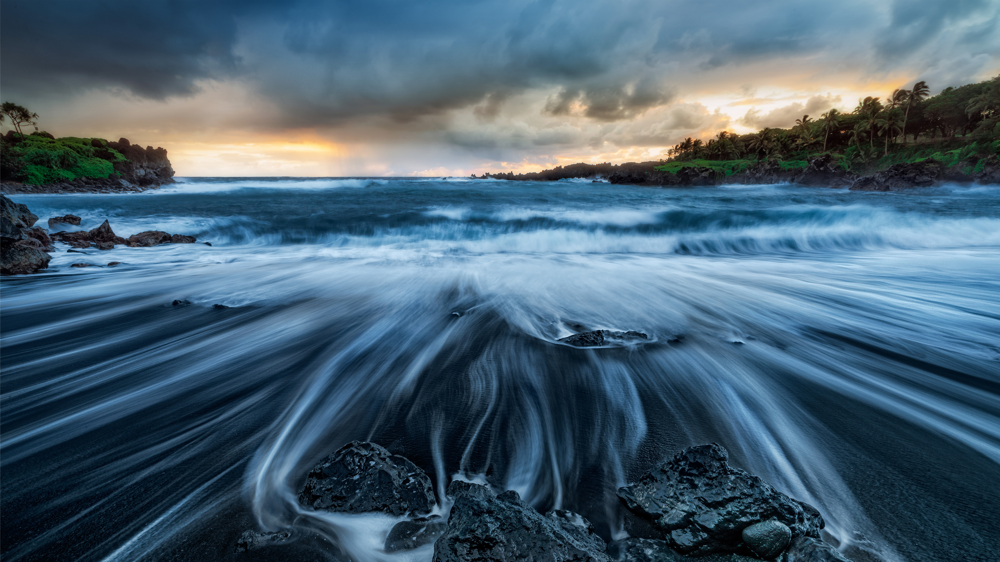

```json
{
  "images": [
    {
      "startdate": "20230603",
      "fullstartdate": "202306031600",
      "enddate": "20230604",
      "url": "/th?id=OHR.MauiBeach_ZH-CN1435658101_UHD.jpg&rf=LaDigue_UHD.jpg&pid=hp&w=3840&h=2160&rs=1&c=4",
      "urlbase": "/th?id=OHR.MauiBeach_ZH-CN1435658101",
      "copyright": "怀阿纳帕纳帕州立公园的黑沙滩，茂宜岛，夏威夷，美国 (© Matt Anderson Photography/Getty Images)",
      "copyrightlink": "/search?q=%e6%80%80%e9%98%bf%e7%ba%b3%e5%b8%95%e7%ba%b3%e5%b8%95%e5%b7%9e%e7%ab%8b%e5%85%ac%e5%9b%ad&form=hpcapt&mkt=zh-cn",
      "title": "热带天堂的黑沙滩",
      "quiz": "/search?q=Bing+homepage+quiz&filters=WQOskey:%22HPQuiz_20230603_MauiBeach%22&FORM=HPQUIZ",
      "wp": true,
      "hsh": "3ba001da32ec77fef4436951a566e9c9",
      "drk": 1,
      "top": 1,
      "bot": 1,
      "hs": []
    }
  ],
  "tooltips": {
    "loading": "正在加载...",
    "previous": "上一个图像",
    "next": "下一个图像",
    "walle": "此图片不能下载用作壁纸。",
    "walls": "下载今日美图。仅限用作桌面壁纸。"
  }
}
```
