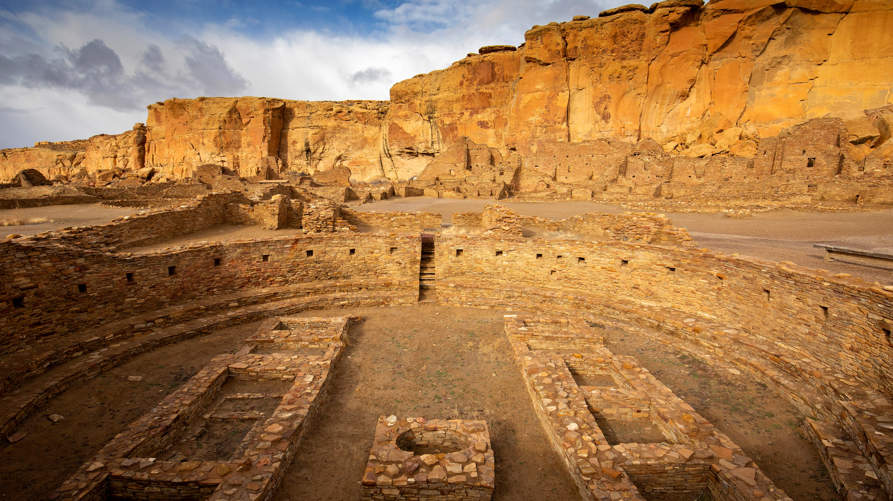

```json
{
  "images": [
    {
      "startdate": "20230606",
      "fullstartdate": "202306061600",
      "enddate": "20230607",
      "url": "/th?id=OHR.ChacoCulture_ZH-CN2098865361_UHD.jpg&rf=LaDigue_UHD.jpg&pid=hp&w=3840&h=2160&rs=1&c=4",
      "urlbase": "/th?id=OHR.ChacoCulture_ZH-CN2098865361",
      "copyright": "普韦布洛·博尼托镇，查科文化国家历史公园，美国新墨西哥州 (© Ian Shive/Tandem Stills + Motion)",
      "copyrightlink": "/search?q=%e6%9f%a5%e7%a7%91%e6%96%87%e5%8c%96%e5%9b%bd%e5%ae%b6%e5%8e%86%e5%8f%b2%e5%85%ac%e5%9b%ad&form=hpcapt&mkt=zh-cn",
      "title": "如果这些墙会说话······",
      "quiz": "/search?q=Bing+homepage+quiz&filters=WQOskey:%22HPQuiz_20230606_ChacoCulture%22&FORM=HPQUIZ",
      "wp": true,
      "hsh": "7c703d3e9c3837311a421e8dc44db7f6",
      "drk": 1,
      "top": 1,
      "bot": 1,
      "hs": []
    }
  ],
  "tooltips": {
    "loading": "正在加载...",
    "previous": "上一个图像",
    "next": "下一个图像",
    "walle": "此图片不能下载用作壁纸。",
    "walls": "下载今日美图。仅限用作桌面壁纸。"
  }
}
```
