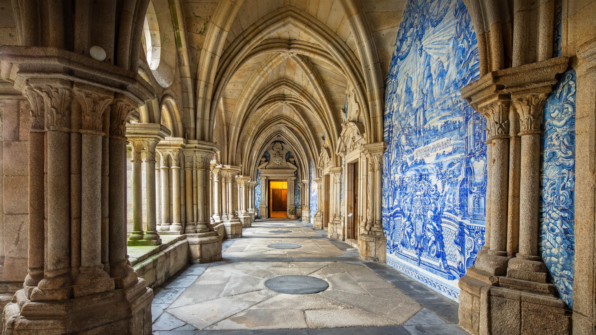

```json
{
  "images": [
    {
      "startdate": "20230609",
      "fullstartdate": "202306091600",
      "enddate": "20230610",
      "url": "/th?id=OHR.PortugalDay_ZH-CN2939429166_UHD.jpg&rf=LaDigue_UHD.jpg&pid=hp&w=3840&h=2160&rs=1&c=4",
      "urlbase": "/th?id=OHR.PortugalDay_ZH-CN2939429166",
      "copyright": "波尔图大教堂, 葡萄牙 (© Reinhard Schmid/Huber/eStock Photo)",
      "copyrightlink": "/search?q=%e6%b3%a2%e5%b0%94%e5%9b%be%e5%a4%a7%e6%95%99%e5%a0%82&form=hpcapt&mkt=zh-cn",
      "title": "波尔图的青花瓷美景",
      "quiz": "/search?q=Bing+homepage+quiz&filters=WQOskey:%22HPQuiz_20230609_PortugalDay%22&FORM=HPQUIZ",
      "wp": true,
      "hsh": "06f50a6344fb9b67bae6742f278ff6ef",
      "drk": 1,
      "top": 1,
      "bot": 1,
      "hs": []
    }
  ],
  "tooltips": {
    "loading": "正在加载...",
    "previous": "上一个图像",
    "next": "下一个图像",
    "walle": "此图片不能下载用作壁纸。",
    "walls": "下载今日美图。仅限用作桌面壁纸。"
  }
}
```
