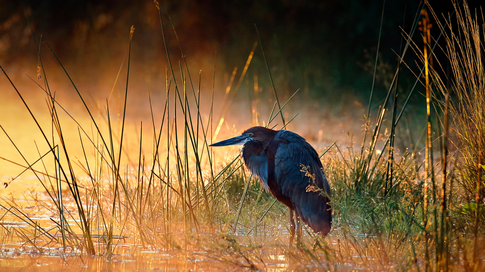

```json
{
  "images": [
    {
      "startdate": "20230610",
      "fullstartdate": "202306101600",
      "enddate": "20230611",
      "url": "/th?id=OHR.GoliathHeron_ZH-CN2413747227_UHD.jpg&rf=LaDigue_UHD.jpg&pid=hp&w=3840&h=2160&rs=1&c=4",
      "urlbase": "/th?id=OHR.GoliathHeron_ZH-CN2413747227",
      "copyright": "巨鹭，克鲁格国家公园，南非 (© Johan Swanepoel/Alamy)",
      "copyrightlink": "/search?q=%e5%b7%a8%e9%b9%ad&form=hpcapt&mkt=zh-cn",
      "title": "伺机而动",
      "quiz": "/search?q=Bing+homepage+quiz&filters=WQOskey:%22HPQuiz_20230610_GoliathHeron%22&FORM=HPQUIZ",
      "wp": true,
      "hsh": "2903a6306a0e7e5d23c251c9209309bc",
      "drk": 1,
      "top": 1,
      "bot": 1,
      "hs": []
    }
  ],
  "tooltips": {
    "loading": "正在加载...",
    "previous": "上一个图像",
    "next": "下一个图像",
    "walle": "此图片不能下载用作壁纸。",
    "walls": "下载今日美图。仅限用作桌面壁纸。"
  }
}
```
