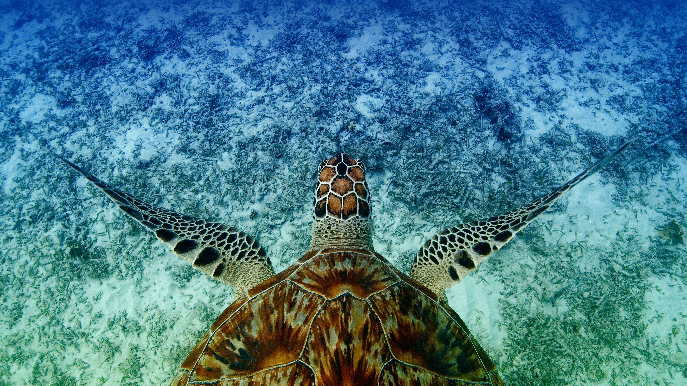

```json
{
  "images": [
    {
      "startdate": "20230615",
      "fullstartdate": "202306151600",
      "enddate": "20230616",
      "url": "/th?id=OHR.HawksbillTurtle_ZH-CN0562063994_UHD.jpg&rf=LaDigue_UHD.jpg&pid=hp&w=3840&h=2160&rs=1&c=4",
      "urlbase": "/th?id=OHR.HawksbillTurtle_ZH-CN0562063994",
      "copyright": "游泳的鹰嘴海龟， 冲绳，日本 (© Robert Mallon/Getty Images)",
      "copyrightlink": "/search?q=%e9%b9%b0%e5%98%b4%e6%b5%b7%e9%be%9f&form=hpcapt&mkt=zh-cn",
      "title": "鹰嘴海龟",
      "quiz": "/search?q=Bing+homepage+quiz&filters=WQOskey:%22HPQuiz_20230615_HawksbillTurtle%22&FORM=HPQUIZ",
      "wp": true,
      "hsh": "f77936405fc0468dcfa09065a1472821",
      "drk": 1,
      "top": 1,
      "bot": 1,
      "hs": []
    }
  ],
  "tooltips": {
    "loading": "正在加载...",
    "previous": "上一个图像",
    "next": "下一个图像",
    "walle": "此图片不能下载用作壁纸。",
    "walls": "下载今日美图。仅限用作桌面壁纸。"
  }
}
```
