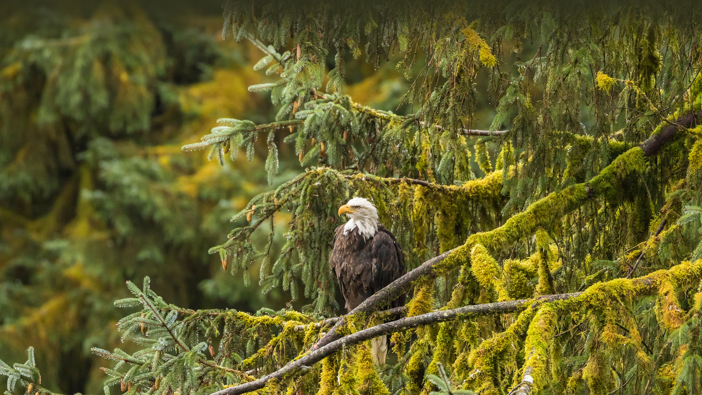

```json
{
  "images": [
    {
      "startdate": "20230619",
      "fullstartdate": "202306191600",
      "enddate": "20230620",
      "url": "/th?id=OHR.EagleTree_ZH-CN7775102951_UHD.jpg&rf=LaDigue_UHD.jpg&pid=hp&w=3840&h=2160&rs=1&c=4",
      "urlbase": "/th?id=OHR.EagleTree_ZH-CN7775102951",
      "copyright": "秃鹰，通加斯国家森林，阿拉斯加，美国 (© Jaynes Gallery/Shutterstock)",
      "copyrightlink": "/search?q=%e7%a7%83%e9%b9%b0&form=hpcapt&mkt=zh-cn",
      "title": "这只顶级掠食者是什么?",
      "quiz": "/search?q=Bing+homepage+quiz&filters=WQOskey:%22HPQuiz_20230619_EagleTree%22&FORM=HPQUIZ",
      "wp": true,
      "hsh": "f2f829b327a13ca637fc35fc2774ba15",
      "drk": 1,
      "top": 1,
      "bot": 1,
      "hs": []
    }
  ],
  "tooltips": {
    "loading": "正在加载...",
    "previous": "上一个图像",
    "next": "下一个图像",
    "walle": "此图片不能下载用作壁纸。",
    "walls": "下载今日美图。仅限用作桌面壁纸。"
  }
}
```
