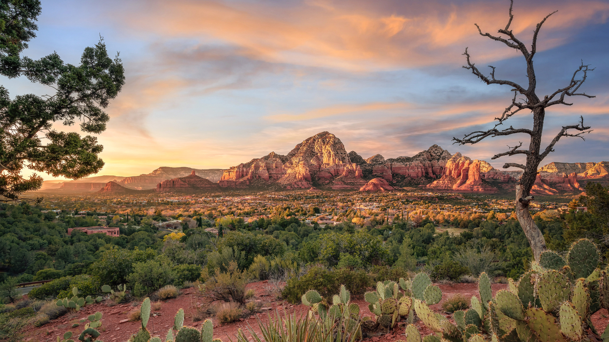

```json
{
  "images": [
    {
      "startdate": "20230626",
      "fullstartdate": "202306261600",
      "enddate": "20230627",
      "url": "/th?id=OHR.SedonaSunset_ZH-CN6289462383_UHD.jpg&rf=LaDigue_UHD.jpg&pid=hp&w=3840&h=2160&rs=1&c=4",
      "urlbase": "/th?id=OHR.SedonaSunset_ZH-CN6289462383",
      "copyright": "塞多纳，亚利桑那州，美国 (© Jonathan Ross/Getty Images)",
      "copyrightlink": "/search?q=%e5%a1%9e%e5%a4%9a%e7%ba%b3&form=hpcapt&mkt=zh-cn",
      "title": "红石的土地",
      "quiz": "/search?q=Bing+homepage+quiz&filters=WQOskey:%22HPQuiz_20230626_SedonaSunset%22&FORM=HPQUIZ",
      "wp": true,
      "hsh": "4c4d189da0fa0f13ecaf2deee07ec87c",
      "drk": 1,
      "top": 1,
      "bot": 1,
      "hs": []
    }
  ],
  "tooltips": {
    "loading": "正在加载...",
    "previous": "上一个图像",
    "next": "下一个图像",
    "walle": "此图片不能下载用作壁纸。",
    "walls": "下载今日美图。仅限用作桌面壁纸。"
  }
}
```
