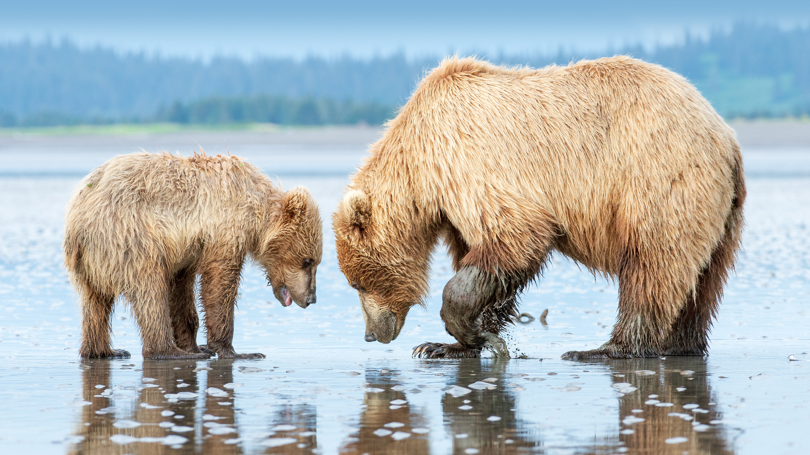

```json
{
  "images": [
    {
      "startdate": "20230629",
      "fullstartdate": "202306291600",
      "enddate": "20230630",
      "url": "/th?id=OHR.ClamBears_ZH-CN5686721500_UHD.jpg&rf=LaDigue_UHD.jpg&pid=hp&w=3840&h=2160&rs=1&c=4",
      "urlbase": "/th?id=OHR.ClamBears_ZH-CN5686721500",
      "copyright": "棕熊妈妈和幼崽，克拉克湖国家公园和自然保护区，美国阿拉斯加州 (© Carlos Carreno/Getty Images)",
      "copyrightlink": "/search?q=%e6%a3%95%e7%86%8a&form=hpcapt&mkt=zh-cn",
      "title": "孩子，你把鱼扔哪儿了？",
      "quiz": "/search?q=Bing+homepage+quiz&filters=WQOskey:%22HPQuiz_20230629_ClamBears%22&FORM=HPQUIZ",
      "wp": true,
      "hsh": "747950bee186beb2a60ed4b04c9e57b3",
      "drk": 1,
      "top": 1,
      "bot": 1,
      "hs": []
    }
  ],
  "tooltips": {
    "loading": "正在加载...",
    "previous": "上一个图像",
    "next": "下一个图像",
    "walle": "此图片不能下载用作壁纸。",
    "walls": "下载今日美图。仅限用作桌面壁纸。"
  }
}
```
