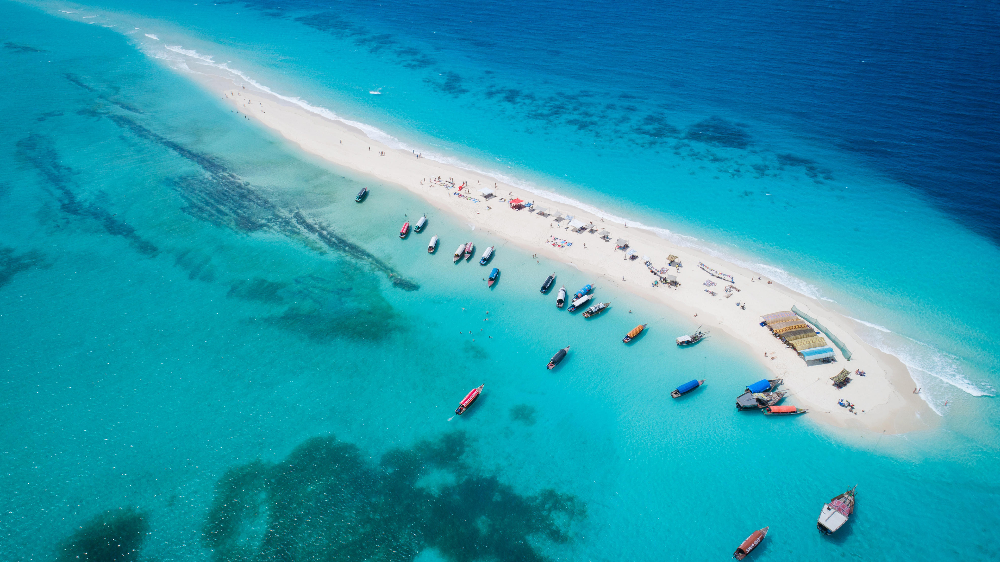

```json
{
  "images": [
    {
      "startdate": "20230711",
      "fullstartdate": "202307111600",
      "enddate": "20230712",
      "url": "/th?id=OHR.NakupendaBeach_ZH-CN7913805608_UHD.jpg&rf=LaDigue_UHD.jpg&pid=hp&w=3840&h=2160&rs=1&c=4",
      "urlbase": "/th?id=OHR.NakupendaBeach_ZH-CN7913805608",
      "copyright": "“我爱你”海滩自然保护区的沙洲，桑给巴尔，坦桑尼亚 (© Lubos Paukeje/Alamy)",
      "copyrightlink": "/search?q=%e5%9d%a6%e6%a1%91%e5%b0%bc%e4%ba%9a%e6%a1%91%e7%bb%99%e5%b7%b4%e5%b0%94&form=hpcapt&mkt=zh-cn",
      "title": "世界上最独特的海滩？",
      "quiz": "/search?q=Bing+homepage+quiz&filters=WQOskey:%22HPQuiz_20230711_NakupendaBeach%22&FORM=HPQUIZ",
      "wp": true,
      "hsh": "11ec21c3913f74b8885cbb989c0aa477",
      "drk": 1,
      "top": 1,
      "bot": 1,
      "hs": []
    }
  ],
  "tooltips": {
    "loading": "正在加载...",
    "previous": "上一个图像",
    "next": "下一个图像",
    "walle": "此图片不能下载用作壁纸。",
    "walls": "下载今日美图。仅限用作桌面壁纸。"
  }
}
```
