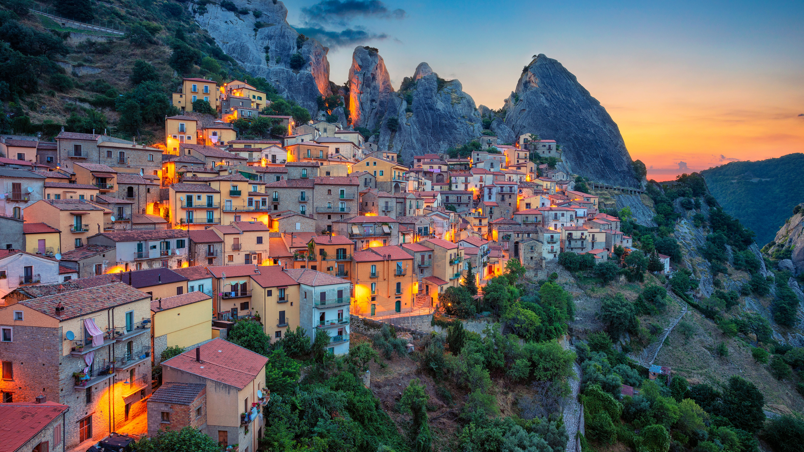

```json
{
  "images": [
    {
      "startdate": "20230714",
      "fullstartdate": "202307141600",
      "enddate": "20230715",
      "url": "/th?id=OHR.CastelmazzanoSunrise_ZH-CN6733875019_UHD.jpg&rf=LaDigue_UHD.jpg&pid=hp&w=3840&h=2160&rs=1&c=4",
      "urlbase": "/th?id=OHR.CastelmazzanoSunrise_ZH-CN6733875019",
      "copyright": "卡斯泰尔梅扎诺，意大利 (© Rudy Balasko/Shutterstock)",
      "copyrightlink": "/search?q=%e6%84%8f%e5%a4%a7%e5%88%a9%e5%8d%a1%e6%96%af%e6%b3%b0%e5%b0%94%e6%a2%85%e6%89%8e%e8%af%ba&form=hpcapt&mkt=zh-cn",
      "title": "明信片般完美的风景",
      "quiz": "/search?q=Bing+homepage+quiz&filters=WQOskey:%22HPQuiz_20230714_CastelmazzanoSunrise%22&FORM=HPQUIZ",
      "wp": true,
      "hsh": "1366eba63159027524eea87c44626407",
      "drk": 1,
      "top": 1,
      "bot": 1,
      "hs": []
    }
  ],
  "tooltips": {
    "loading": "正在加载...",
    "previous": "上一个图像",
    "next": "下一个图像",
    "walle": "此图片不能下载用作壁纸。",
    "walls": "下载今日美图。仅限用作桌面壁纸。"
  }
}
```
