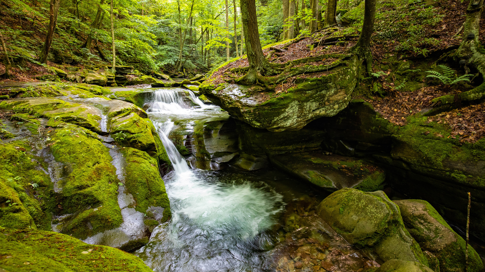

```json
{
  "images": [
    {
      "startdate": "20230715",
      "fullstartdate": "202307151600",
      "enddate": "20230716",
      "url": "/th?id=OHR.BearHoleBrook_ZH-CN6855885557_UHD.jpg&rf=LaDigue_UHD.jpg&pid=hp&w=3840&h=2160&rs=1&c=4",
      "urlbase": "/th?id=OHR.BearHoleBrook_ZH-CN6855885557",
      "copyright": "熊洞溪，卡茨基尔山脉，纽约，美国 (© GummyBone/Getty Images)",
      "copyrightlink": "/search?q=%e5%8d%a1%e8%8c%a8%e5%9f%ba%e5%b0%94%e5%b1%b1%e8%84%89&form=hpcapt&mkt=zh-cn",
      "title": "溪水潺潺",
      "quiz": "/search?q=Bing+homepage+quiz&filters=WQOskey:%22HPQuiz_20230715_BearHoleBrook%22&FORM=HPQUIZ",
      "wp": true,
      "hsh": "e95a7e69368f757f9df4a9d522a39707",
      "drk": 1,
      "top": 1,
      "bot": 1,
      "hs": []
    }
  ],
  "tooltips": {
    "loading": "正在加载...",
    "previous": "上一个图像",
    "next": "下一个图像",
    "walle": "此图片不能下载用作壁纸。",
    "walls": "下载今日美图。仅限用作桌面壁纸。"
  }
}
```
