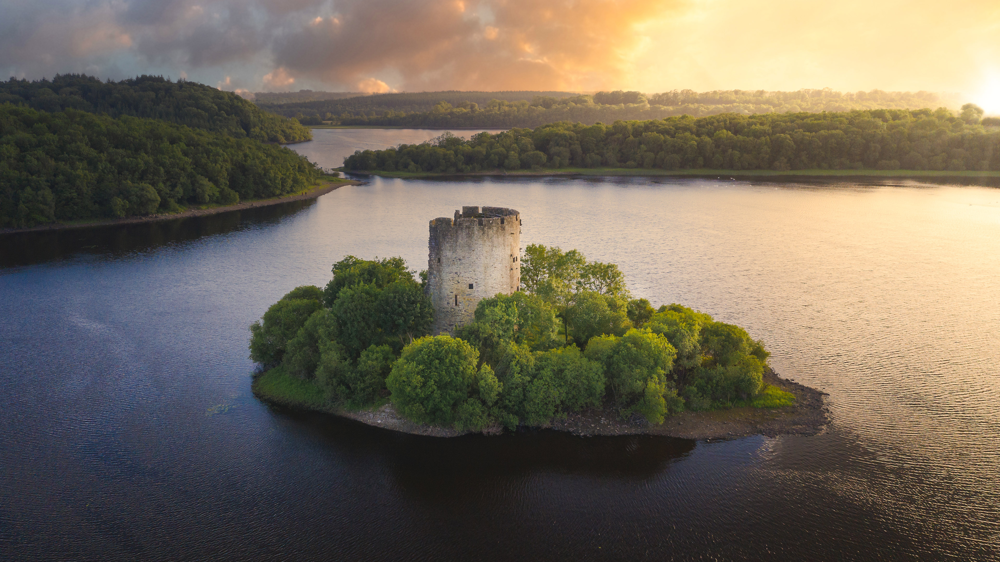

```json
{
  "images": [
    {
      "startdate": "20230716",
      "fullstartdate": "202307161600",
      "enddate": "20230717",
      "url": "/th?id=OHR.CavanCastle_ZH-CN7109317900_UHD.jpg&rf=LaDigue_UHD.jpg&pid=hp&w=3840&h=2160&rs=1&c=4",
      "urlbase": "/th?id=OHR.CavanCastle_ZH-CN7109317900",
      "copyright": "乌特湖的克拉夫特城堡，卡文郡，爱尔兰 (© 4H4 PH/Shutterstock)",
      "copyrightlink": "/search?q=%e5%8d%a1%e6%96%87%e9%83%a1&form=hpcapt&mkt=zh-cn",
      "title": "古老的中世纪奇迹",
      "quiz": "/search?q=Bing+homepage+quiz&filters=WQOskey:%22HPQuiz_20230716_CavanCastle%22&FORM=HPQUIZ",
      "wp": true,
      "hsh": "4be7edc21686493d0410c14c558fe3b9",
      "drk": 1,
      "top": 1,
      "bot": 1,
      "hs": []
    }
  ],
  "tooltips": {
    "loading": "正在加载...",
    "previous": "上一个图像",
    "next": "下一个图像",
    "walle": "此图片不能下载用作壁纸。",
    "walls": "下载今日美图。仅限用作桌面壁纸。"
  }
}
```
