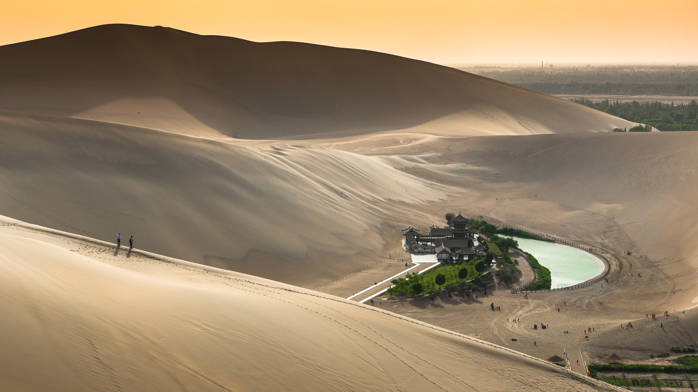

```json
{
  "images": [
    {
      "startdate": "20230718",
      "fullstartdate": "202307181600",
      "enddate": "20230719",
      "url": "/th?id=OHR.CrescentLake_ZH-CN8294493832_UHD.jpg&rf=LaDigue_UHD.jpg&pid=hp&w=3840&h=2160&rs=1&c=4",
      "urlbase": "/th?id=OHR.CrescentLake_ZH-CN8294493832",
      "copyright": "敦煌月牙泉，甘肃省，中国 (© R7 Photo/Shutterstock)",
      "copyrightlink": "/search?q=%e6%95%a6%e7%85%8c%e6%9c%88%e7%89%99%e6%b3%89&form=hpcapt&mkt=zh-cn",
      "title": "这片湖泊可不是海市蜃楼",
      "quiz": "/search?q=Bing+homepage+quiz&filters=WQOskey:%22HPQuiz_20230718_CrescentLake%22&FORM=HPQUIZ",
      "wp": true,
      "hsh": "68e08528b92565f9f3904bab89a3ed83",
      "drk": 1,
      "top": 1,
      "bot": 1,
      "hs": []
    }
  ],
  "tooltips": {
    "loading": "正在加载...",
    "previous": "上一个图像",
    "next": "下一个图像",
    "walle": "此图片不能下载用作壁纸。",
    "walls": "下载今日美图。仅限用作桌面壁纸。"
  }
}
```
