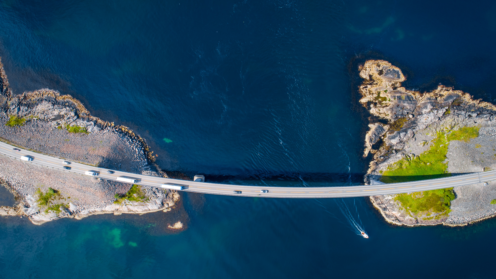

```json
{
  "images": [
    {
      "startdate": "20230720",
      "fullstartdate": "202307201600",
      "enddate": "20230721",
      "url": "/th?id=OHR.BridgeNorway_ZH-CN9063814637_UHD.jpg&rf=LaDigue_UHD.jpg&pid=hp&w=3840&h=2160&rs=1&c=4",
      "urlbase": "/th?id=OHR.BridgeNorway_ZH-CN9063814637",
      "copyright": "斯托尔桑德特大桥，挪威 (© Morten Falch Sortland/Getty Images)",
      "copyrightlink": "/search?q=%e6%8c%aa%e5%a8%81%e6%96%af%e6%89%98%e5%b0%94%e6%a1%91%e5%be%b7%e7%89%b9%e5%a4%a7%e6%a1%a5&form=hpcapt&mkt=zh-cn",
      "title": "将散落的岛屿连接在一起",
      "quiz": "/search?q=Bing+homepage+quiz&filters=WQOskey:%22HPQuiz_20230720_BridgeNorway%22&FORM=HPQUIZ",
      "wp": true,
      "hsh": "3b603ee14f3734862a41072b97ca6e51",
      "drk": 1,
      "top": 1,
      "bot": 1,
      "hs": []
    }
  ],
  "tooltips": {
    "loading": "正在加载...",
    "previous": "上一个图像",
    "next": "下一个图像",
    "walle": "此图片不能下载用作壁纸。",
    "walls": "下载今日美图。仅限用作桌面壁纸。"
  }
}
```
