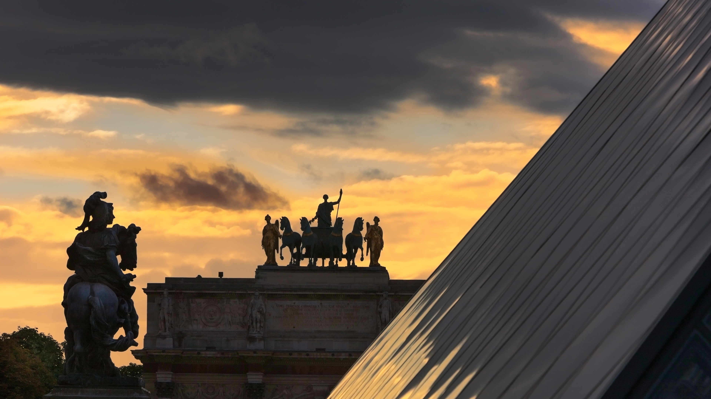

```json
{
  "images": [
    {
      "startdate": "20230726",
      "fullstartdate": "202307261600",
      "enddate": "20230727",
      "url": "/th?id=OHR.ParisLouvre_ZH-CN0341884841_UHD.jpg&rf=LaDigue_UHD.jpg&pid=hp&w=3840&h=2160&rs=1&c=4",
      "urlbase": "/th?id=OHR.ParisLouvre_ZH-CN0341884841",
      "copyright": "卡鲁塞尔凯旋门和卢浮宫金字塔，巴黎，法国 (© Jon Hicks/Getty Images)",
      "copyrightlink": "/search?q=%e5%8d%a1%e9%b2%81%e5%a1%9e%e5%b0%94%e5%87%af%e6%97%8b%e9%97%a8&form=hpcapt&mkt=zh-cn",
      "title": "凯旋的姿态",
      "quiz": "/search?q=Bing+homepage+quiz&filters=WQOskey:%22HPQuiz_20230726_ParisLouvre%22&FORM=HPQUIZ",
      "wp": true,
      "hsh": "64546466f986ce699ae75617f760f755",
      "drk": 1,
      "top": 1,
      "bot": 1,
      "hs": []
    }
  ],
  "tooltips": {
    "loading": "正在加载...",
    "previous": "上一个图像",
    "next": "下一个图像",
    "walle": "此图片不能下载用作壁纸。",
    "walls": "下载今日美图。仅限用作桌面壁纸。"
  }
}
```
