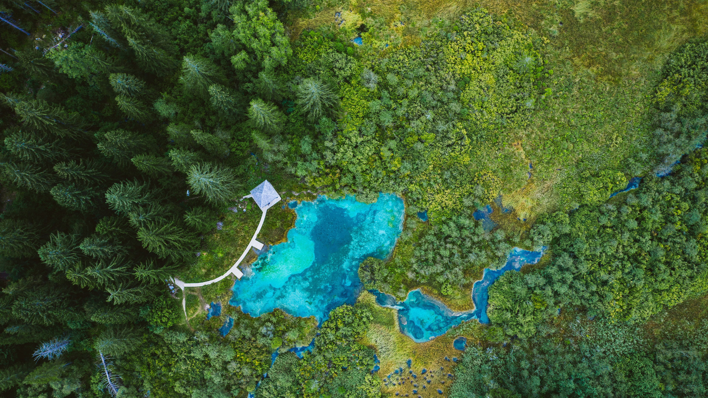

```json
{
  "images": [
    {
      "startdate": "20230802",
      "fullstartdate": "202308021600",
      "enddate": "20230803",
      "url": "/th?id=OHR.ZelenciSprings_ZH-CN8022746409_UHD.jpg&rf=LaDigue_UHD.jpg&pid=hp&w=3840&h=2160&rs=1&c=4",
      "urlbase": "/th?id=OHR.ZelenciSprings_ZH-CN8022746409",
      "copyright": "泽伦西自然保护区，斯洛文尼亚 (© Andrey Danilovich/Getty Images)",
      "copyrightlink": "/search?q=%e6%96%af%e6%b4%9b%e6%96%87%e5%b0%bc%e4%ba%9a%e6%b3%bd%e4%bc%a6%e8%a5%bf%e8%87%aa%e7%84%b6%e4%bf%9d%e6%8a%a4%e5%8c%ba&form=hpcapt&mkt=zh-cn",
      "title": "绿松石般的泉水",
      "quiz": "/search?q=Bing+homepage+quiz&filters=WQOskey:%22HPQuiz_20230802_ZelenciSprings%22&FORM=HPQUIZ",
      "wp": true,
      "hsh": "d3cf8166a491718f66b8cfd95b32b6b9",
      "drk": 1,
      "top": 1,
      "bot": 1,
      "hs": []
    }
  ],
  "tooltips": {
    "loading": "正在加载...",
    "previous": "上一个图像",
    "next": "下一个图像",
    "walle": "此图片不能下载用作壁纸。",
    "walls": "下载今日美图。仅限用作桌面壁纸。"
  }
}
```
