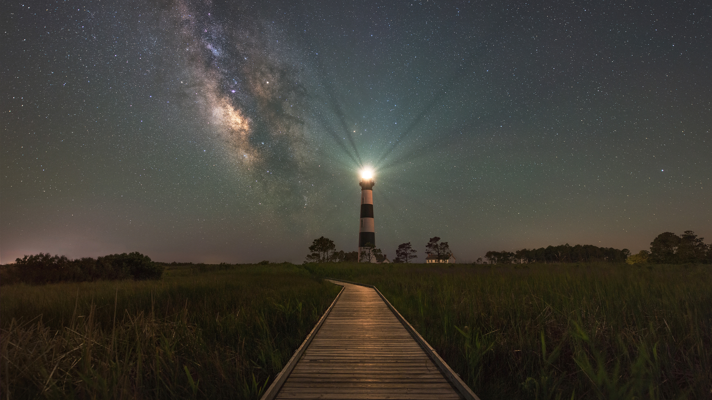

```json
{
  "images": [
    {
      "startdate": "20230806",
      "fullstartdate": "202308061600",
      "enddate": "20230807",
      "url": "/th?id=OHR.BodieNC_ZH-CN9027999004_UHD.jpg&rf=LaDigue_UHD.jpg&pid=hp&w=3840&h=2160&rs=1&c=4",
      "urlbase": "/th?id=OHR.BodieNC_ZH-CN9027999004",
      "copyright": "博迪岛灯塔，马头城，北卡罗来纳州，美国 (© Michael Ver Sprill/Getty Images)",
      "copyrightlink": "/search?q=%e5%8d%9a%e8%bf%aa%e5%b2%9b%e7%81%af%e5%a1%94&form=hpcapt&mkt=zh-cn",
      "title": "地上一点，天上万千",
      "quiz": "/search?q=Bing+homepage+quiz&filters=WQOskey:%22HPQuiz_20230806_BodieNC%22&FORM=HPQUIZ",
      "wp": true,
      "hsh": "0d0b07e889ed02ad02e9529ee84b096c",
      "drk": 1,
      "top": 1,
      "bot": 1,
      "hs": []
    }
  ],
  "tooltips": {
    "loading": "正在加载...",
    "previous": "上一个图像",
    "next": "下一个图像",
    "walle": "此图片不能下载用作壁纸。",
    "walls": "下载今日美图。仅限用作桌面壁纸。"
  }
}
```
