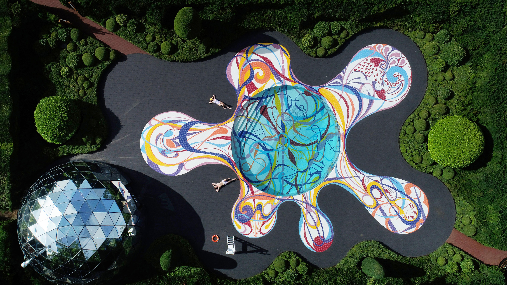

```json
{
  "images": [
    {
      "startdate": "20230810",
      "fullstartdate": "202308101600",
      "enddate": "20230811",
      "url": "/th?id=OHR.JupiterArtland_ZH-CN7955790073_UHD.jpg&rf=LaDigue_UHD.jpg&pid=hp&w=3840&h=2160&rs=1&c=4",
      "urlbase": "/th?id=OHR.JupiterArtland_ZH-CN7955790073",
      "copyright": "'朱庇特艺术园的“入口”水池，爱丁堡，苏格兰 (© Owen Humphreys/PA Images/Alamy)",
      "copyrightlink": "/search?q=%e7%88%b1%e4%b8%81%e5%a0%a1%e8%89%ba%e6%9c%af%e8%8a%82&form=hpcapt&mkt=zh-cn",
      "title": "独一无二的一朵“水花”",
      "quiz": "/search?q=Bing+homepage+quiz&filters=WQOskey:%22HPQuiz_20230810_JupiterArtland%22&FORM=HPQUIZ",
      "wp": true,
      "hsh": "f5571ef58a9a5042fd4f37a939edeaf1",
      "drk": 1,
      "top": 1,
      "bot": 1,
      "hs": []
    }
  ],
  "tooltips": {
    "loading": "正在加载...",
    "previous": "上一个图像",
    "next": "下一个图像",
    "walle": "此图片不能下载用作壁纸。",
    "walls": "下载今日美图。仅限用作桌面壁纸。"
  }
}
```
