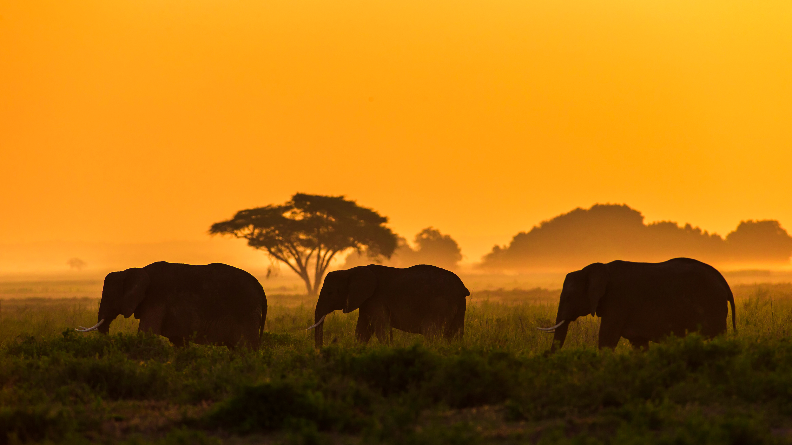

```json
{
  "images": [
    {
      "startdate": "20230811",
      "fullstartdate": "202308111600",
      "enddate": "20230812",
      "url": "/th?id=OHR.ThreeElephants_ZH-CN8708711085_UHD.jpg&rf=LaDigue_UHD.jpg&pid=hp&w=3840&h=2160&rs=1&c=4",
      "urlbase": "/th?id=OHR.ThreeElephants_ZH-CN8708711085",
      "copyright": "大象家族，安波塞利国家公园，肯尼亚 (© Ibrahim Suha Derbent/Getty Images)",
      "copyrightlink": "/search?q=%e4%b8%96%e7%95%8c%e5%a4%a7%e8%b1%a1%e6%97%a5&form=hpcapt&mkt=zh-cn",
      "title": "保护温柔的巨人",
      "quiz": "/search?q=Bing+homepage+quiz&filters=WQOskey:%22HPQuiz_20230811_ThreeElephants%22&FORM=HPQUIZ",
      "wp": true,
      "hsh": "cf454d257729df2644f0ea2b0828390e",
      "drk": 1,
      "top": 1,
      "bot": 1,
      "hs": []
    }
  ],
  "tooltips": {
    "loading": "正在加载...",
    "previous": "上一个图像",
    "next": "下一个图像",
    "walle": "此图片不能下载用作壁纸。",
    "walls": "下载今日美图。仅限用作桌面壁纸。"
  }
}
```
