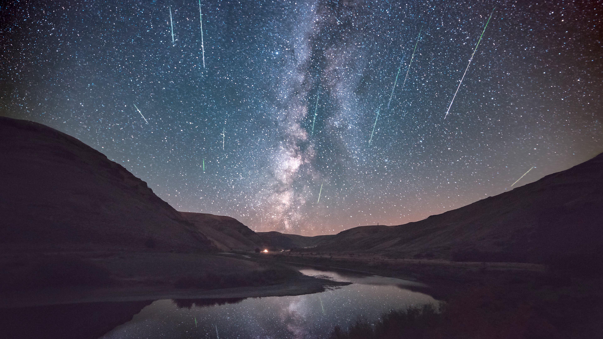

```json
{
  "images": [
    {
      "startdate": "20230812",
      "fullstartdate": "202308121600",
      "enddate": "20230813",
      "url": "/th?id=OHR.PerseidsOregon_ZH-CN9427980491_UHD.jpg&rf=LaDigue_UHD.jpg&pid=hp&w=3840&h=2160&rs=1&c=4",
      "urlbase": "/th?id=OHR.PerseidsOregon_ZH-CN9427980491",
      "copyright": "英仙座流星雨，白杨木峡谷州立公园，俄勒冈州，美国 (© Joshua Meador/Tandem Stills + Motion)",
      "copyrightlink": "/search?q=%e8%8b%b1%e4%bb%99%e5%ba%a7%e6%b5%81%e6%98%9f%e9%9b%a8&form=hpcapt&mkt=zh-cn",
      "title": "抬头看，它来了",
      "quiz": "/search?q=Bing+homepage+quiz&filters=WQOskey:%22HPQuiz_20230812_PerseidsOregon%22&FORM=HPQUIZ",
      "wp": true,
      "hsh": "197d1a96dea3304266096a0bce8cfbfb",
      "drk": 1,
      "top": 1,
      "bot": 1,
      "hs": []
    }
  ],
  "tooltips": {
    "loading": "正在加载...",
    "previous": "上一个图像",
    "next": "下一个图像",
    "walle": "此图片不能下载用作壁纸。",
    "walls": "下载今日美图。仅限用作桌面壁纸。"
  }
}
```
