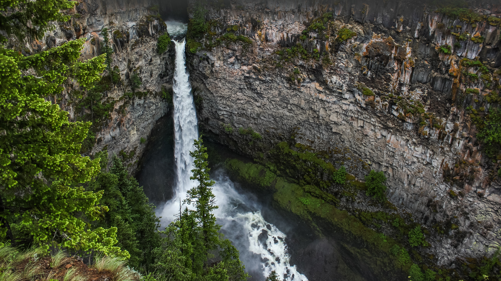

```json
{
  "images": [
    {
      "startdate": "20230816",
      "fullstartdate": "202308161600",
      "enddate": "20230817",
      "url": "/th?id=OHR.HelmckenWaterfall_ZH-CN9694510761_UHD.jpg&rf=LaDigue_UHD.jpg&pid=hp&w=3840&h=2160&rs=1&c=4",
      "urlbase": "/th?id=OHR.HelmckenWaterfall_ZH-CN9694510761",
      "copyright": "罕肯瀑布,威尔斯格雷省立公园, 加拿大不列颠哥伦比亚省 (© Laurens Verhoeven/Getty Images)",
      "copyrightlink": "/search?q=%e5%a8%81%e5%b0%94%e6%96%af%e6%a0%bc%e9%9b%b7%e7%9c%81%e7%ab%8b%e5%85%ac%e5%9b%ad&form=hpcapt&mkt=zh-cn",
      "title": "听它咆哮！",
      "quiz": "/search?q=Bing+homepage+quiz&filters=WQOskey:%22HPQuiz_20230816_HelmckenWaterfall%22&FORM=HPQUIZ",
      "wp": true,
      "hsh": "a8d661de0353657f367c461c34ed104e",
      "drk": 1,
      "top": 1,
      "bot": 1,
      "hs": []
    }
  ],
  "tooltips": {
    "loading": "正在加载...",
    "previous": "上一个图像",
    "next": "下一个图像",
    "walle": "此图片不能下载用作壁纸。",
    "walls": "下载今日美图。仅限用作桌面壁纸。"
  }
}
```
