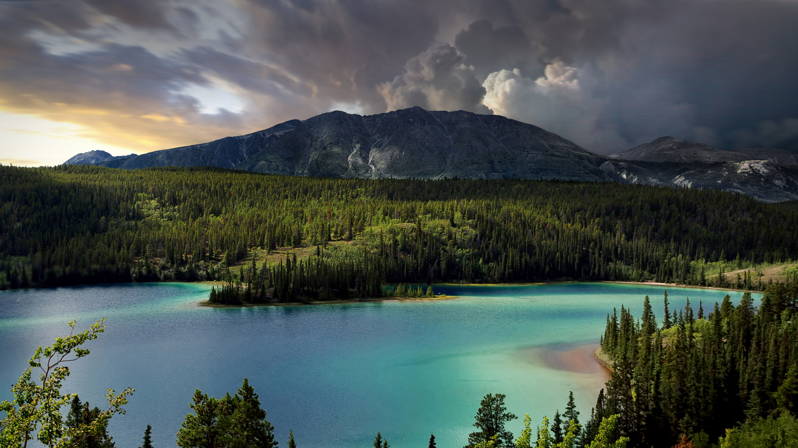

```json
{
  "images": [
    {
      "startdate": "20230820",
      "fullstartdate": "202308201600",
      "enddate": "20230821",
      "url": "/th?id=OHR.EmeraldLakeYukon_ZH-CN4281156537_UHD.jpg&rf=LaDigue_UHD.jpg&pid=hp&w=3840&h=2160&rs=1&c=4",
      "urlbase": "/th?id=OHR.EmeraldLakeYukon_ZH-CN4281156537",
      "copyright": "翡翠湖，加拿大育空地区 (© artherng/Getty Images)",
      "copyrightlink": "/search?q=%e5%8a%a0%e6%8b%bf%e5%a4%a7%e8%82%b2%e7%a9%ba%e5%9c%b0%e5%8c%ba&form=hpcapt&mkt=zh-cn",
      "title": "自内而外的光彩",
      "quiz": "/search?q=Bing+homepage+quiz&filters=WQOskey:%22HPQuiz_20230820_EmeraldLakeYukon%22&FORM=HPQUIZ",
      "wp": true,
      "hsh": "4dcae2d3d6d89fc9f0f3da4a6eb49b92",
      "drk": 1,
      "top": 1,
      "bot": 1,
      "hs": []
    }
  ],
  "tooltips": {
    "loading": "正在加载...",
    "previous": "上一个图像",
    "next": "下一个图像",
    "walle": "此图片不能下载用作壁纸。",
    "walls": "下载今日美图。仅限用作桌面壁纸。"
  }
}
```
