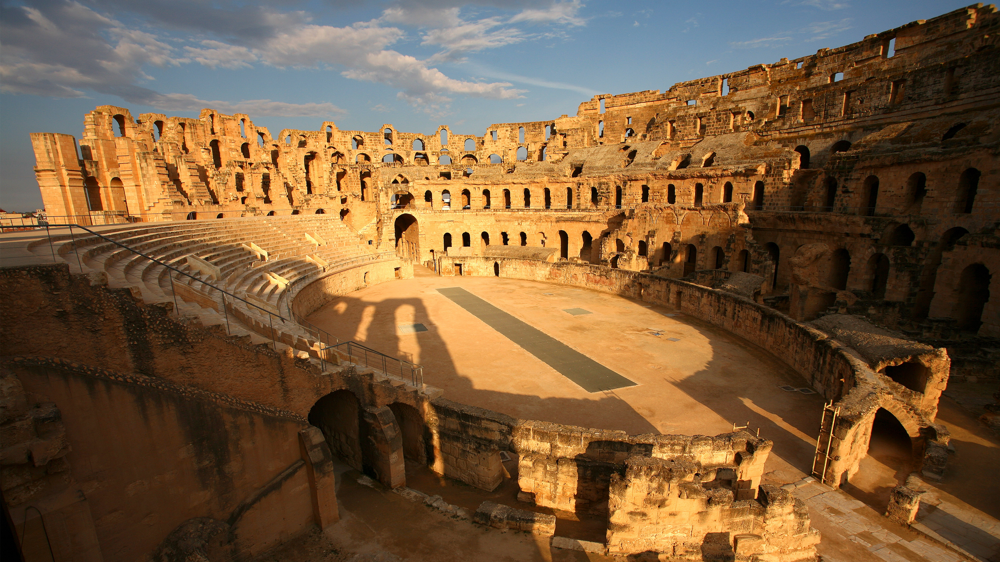

```json
{
  "images": [
    {
      "startdate": "20230821",
      "fullstartdate": "202308211600",
      "enddate": "20230822",
      "url": "/th?id=OHR.TunisiaAmphitheatre_ZH-CN4431856872_UHD.jpg&rf=LaDigue_UHD.jpg&pid=hp&w=3840&h=2160&rs=1&c=4",
      "urlbase": "/th?id=OHR.TunisiaAmphitheatre_ZH-CN4431856872",
      "copyright": "埃尔杰姆露天剧场，突尼斯 (© Westend61/Getty Images)",
      "copyrightlink": "/search?q=%e5%9f%83%e5%b0%94%e6%9d%b0%e5%a7%86%e9%9c%b2%e5%a4%a9%e5%89%a7%e5%9c%ba&form=hpcapt&mkt=zh-cn",
      "title": "为罗马建筑“起立欢呼”",
      "quiz": "/search?q=Bing+homepage+quiz&filters=WQOskey:%22HPQuiz_20230821_TunisiaAmphitheatre%22&FORM=HPQUIZ",
      "wp": true,
      "hsh": "529d4195aa0805d5e9189b81e216eaf5",
      "drk": 1,
      "top": 1,
      "bot": 1,
      "hs": []
    }
  ],
  "tooltips": {
    "loading": "正在加载...",
    "previous": "上一个图像",
    "next": "下一个图像",
    "walle": "此图片不能下载用作壁纸。",
    "walls": "下载今日美图。仅限用作桌面壁纸。"
  }
}
```
