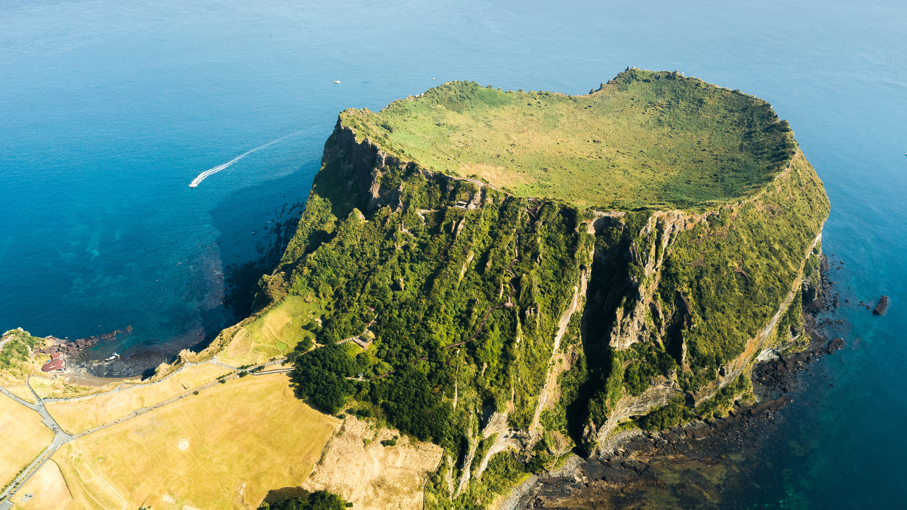

```json
{
  "images": [
    {
      "startdate": "20230826",
      "fullstartdate": "202308261600",
      "enddate": "20230827",
      "url": "/th?id=OHR.JejuIsland_ZH-CN8434910851_UHD.jpg&rf=LaDigue_UHD.jpg&pid=hp&w=3840&h=2160&rs=1&c=4",
      "urlbase": "/th?id=OHR.JejuIsland_ZH-CN8434910851",
      "copyright": "城山日出峰，济州岛上的凝灰岩锥，韩国 (© Quynh Anh Nguyen/Getty Images)",
      "copyrightlink": "/search?q=%e6%b5%8e%e5%b7%9e%e5%b2%9b&form=hpcapt&mkt=zh-cn",
      "title": "一个酷炫的凝灰岩火山口",
      "quiz": "/search?q=Bing+homepage+quiz&filters=WQOskey:%22HPQuiz_20230826_JejuIsland%22&FORM=HPQUIZ",
      "wp": true,
      "hsh": "6ac5775255f355df98c4d9f72f892bd0",
      "drk": 1,
      "top": 1,
      "bot": 1,
      "hs": []
    }
  ],
  "tooltips": {
    "loading": "正在加载...",
    "previous": "上一个图像",
    "next": "下一个图像",
    "walle": "此图片不能下载用作壁纸。",
    "walls": "下载今日美图。仅限用作桌面壁纸。"
  }
}
```
