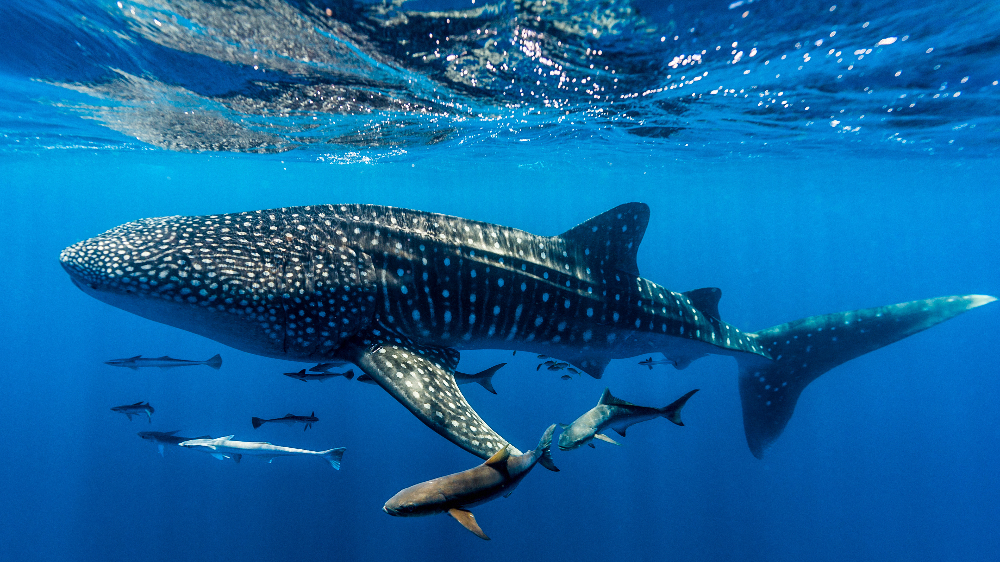

```json
{
  "images": [
    {
      "startdate": "20230829",
      "fullstartdate": "202308291600",
      "enddate": "20230830",
      "url": "/th?id=OHR.NingalooShark_ZH-CN9014712175_UHD.jpg&rf=LaDigue_UHD.jpg&pid=hp&w=3840&h=2160&rs=1&c=4",
      "urlbase": "/th?id=OHR.NingalooShark_ZH-CN9014712175",
      "copyright": "鲸鲨，宁加洛珊瑚礁，西澳大利亚 (© Jason Edwards/Getty Images)",
      "copyrightlink": "/search?q=%e9%b2%b8%e9%b2%a8&form=hpcapt&mkt=zh-cn",
      "title": "潜水员的“大伙伴”",
      "quiz": "/search?q=Bing+homepage+quiz&filters=WQOskey:%22HPQuiz_20230829_NingalooShark%22&FORM=HPQUIZ",
      "wp": true,
      "hsh": "f2f9f137c3ac6985a5b849701e839992",
      "drk": 1,
      "top": 1,
      "bot": 1,
      "hs": []
    }
  ],
  "tooltips": {
    "loading": "正在加载...",
    "previous": "上一个图像",
    "next": "下一个图像",
    "walle": "此图片不能下载用作壁纸。",
    "walls": "下载今日美图。仅限用作桌面壁纸。"
  }
}
```
