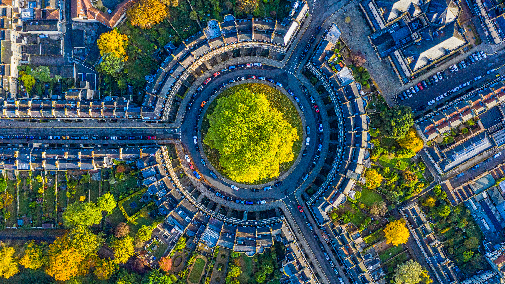

```json
{
  "images": [
    {
      "startdate": "20230907",
      "fullstartdate": "202309071600",
      "enddate": "20230908",
      "url": "/th?id=OHR.BathCircus_ZH-CN5796600786_UHD.jpg&rf=LaDigue_UHD.jpg&pid=hp&w=3840&h=2160&rs=1&c=4",
      "urlbase": "/th?id=OHR.BathCircus_ZH-CN5796600786",
      "copyright": "巴斯圆形广场，萨默塞特 ，英国 (© Gavin Hellier/Getty Images)",
      "copyrightlink": "/search?q=%e5%9b%bd%e9%99%85%e6%89%ab%e7%9b%b2%e6%97%a5&form=hpcapt&mkt=zh-cn",
      "title": "简·奥斯汀的文学圈",
      "quiz": "/search?q=Bing+homepage+quiz&filters=WQOskey:%22HPQuiz_20230907_BathCircus%22&FORM=HPQUIZ",
      "wp": true,
      "hsh": "fdd9d3e8d109fd24ac6fbfa321022ce6",
      "drk": 1,
      "top": 1,
      "bot": 1,
      "hs": []
    }
  ],
  "tooltips": {
    "loading": "正在加载...",
    "previous": "上一个图像",
    "next": "下一个图像",
    "walle": "此图片不能下载用作壁纸。",
    "walls": "下载今日美图。仅限用作桌面壁纸。"
  }
}
```
