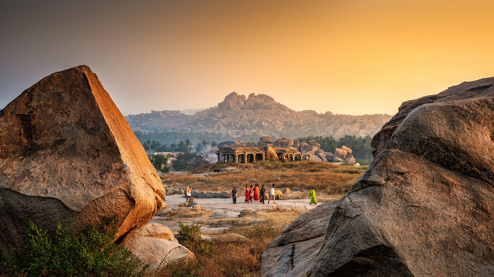

```json
{
  "images": [
    {
      "startdate": "20230912",
      "fullstartdate": "202309121600",
      "enddate": "20230913",
      "url": "/th?id=OHR.HemakutaHill_ZH-CN7438439036_UHD.jpg&rf=LaDigue_UHD.jpg&pid=hp&w=3840&h=2160&rs=1&c=4",
      "urlbase": "/th?id=OHR.HemakutaHill_ZH-CN7438439036",
      "copyright": "赫马库塔山上的神庙，汉皮，卡纳塔克邦，印度 (© Images of india/Alamy Stock Photo)",
      "copyrightlink": "/search?q=%e5%8d%a1%e7%ba%b3%e5%a1%94%e5%85%8b%e9%82%a6%e8%b5%ab%e9%a9%ac%e5%ba%93%e5%a1%94%e5%b1%b1&form=hpcapt&mkt=zh-cn",
      "title": "往事的低语",
      "quiz": "/search?q=Bing+homepage+quiz&filters=WQOskey:%22HPQuiz_20230912_HemakutaHill%22&FORM=HPQUIZ",
      "wp": true,
      "hsh": "00a229adba9ba0e36570c1c5141bf83b",
      "drk": 1,
      "top": 1,
      "bot": 1,
      "hs": []
    }
  ],
  "tooltips": {
    "loading": "正在加载...",
    "previous": "上一个图像",
    "next": "下一个图像",
    "walle": "此图片不能下载用作壁纸。",
    "walls": "下载今日美图。仅限用作桌面壁纸。"
  }
}
```
