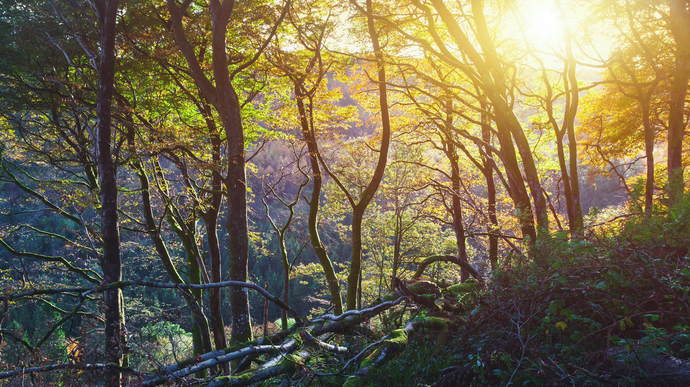

```json
{
  "images": [
    {
      "startdate": "20230914",
      "fullstartdate": "202309141600",
      "enddate": "20230915",
      "url": "/th?id=OHR.GlenariffForest_ZH-CN7874768337_UHD.jpg&rf=LaDigue_UHD.jpg&pid=hp&w=3840&h=2160&rs=1&c=4",
      "urlbase": "/th?id=OHR.GlenariffForest_ZH-CN7874768337",
      "copyright": "格莱纳里夫森林公园的日落，安特里姆郡，爱尔兰 (© Peter Zelei/Getty Images)",
      "copyrightlink": "/search?q=%e7%88%b1%e5%b0%94%e5%85%b0%e5%ae%89%e7%89%b9%e9%87%8c%e5%a7%86%e9%83%a1&form=hpcapt&mkt=zh-cn",
      "title": "山谷女王",
      "quiz": "/search?q=Bing+homepage+quiz&filters=WQOskey:%22HPQuiz_20230914_GlenariffForest%22&FORM=HPQUIZ",
      "wp": true,
      "hsh": "e9ae97c5d2d2f7a4b7aedd2865947b43",
      "drk": 1,
      "top": 1,
      "bot": 1,
      "hs": []
    }
  ],
  "tooltips": {
    "loading": "正在加载...",
    "previous": "上一个图像",
    "next": "下一个图像",
    "walle": "此图片不能下载用作壁纸。",
    "walls": "下载今日美图。仅限用作桌面壁纸。"
  }
}
```
