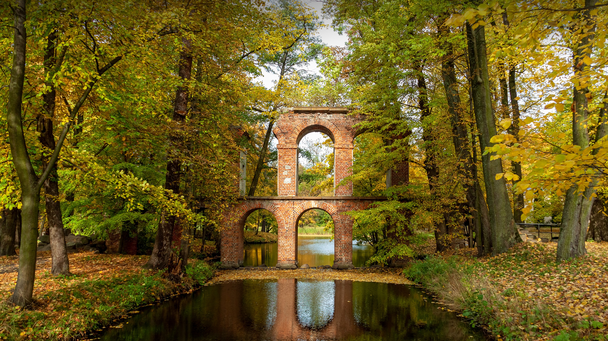

```json
{
  "images": [
    {
      "startdate": "20230919",
      "fullstartdate": "202309191600",
      "enddate": "20230920",
      "url": "/th?id=OHR.ArkadiaPark_ZH-CN9501056317_UHD.jpg&rf=LaDigue_UHD.jpg&pid=hp&w=3840&h=2160&rs=1&c=4",
      "urlbase": "/th?id=OHR.ArkadiaPark_ZH-CN9501056317",
      "copyright": "罗马风格的渡槽，阿卡迪亚公园，波兰 (© PATSTOCK/Getty Images)",
      "copyrightlink": "/search?q=%e6%b8%a1%e6%a7%bd&form=hpcapt&mkt=zh-cn",
      "title": "桥下和桥上的水流",
      "quiz": "/search?q=Bing+homepage+quiz&filters=WQOskey:%22HPQuiz_20230919_ArkadiaPark%22&FORM=HPQUIZ",
      "wp": true,
      "hsh": "dd298e83a3f8d54c5e674ac0cb79db8d",
      "drk": 1,
      "top": 1,
      "bot": 1,
      "hs": []
    }
  ],
  "tooltips": {
    "loading": "正在加载...",
    "previous": "上一个图像",
    "next": "下一个图像",
    "walle": "此图片不能下载用作壁纸。",
    "walls": "下载今日美图。仅限用作桌面壁纸。"
  }
}
```
