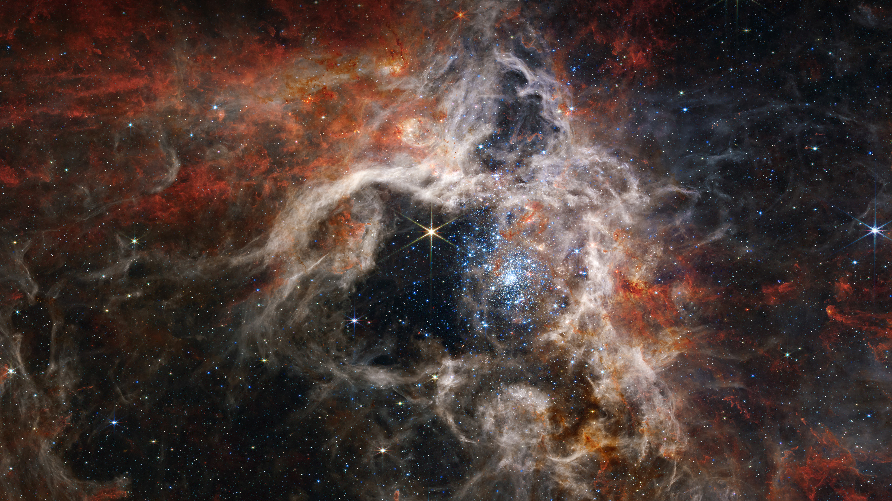

```json
{
  "images": [
    {
      "startdate": "20231003",
      "fullstartdate": "202310031600",
      "enddate": "20231004",
      "url": "/th?id=OHR.TarantulaNebula_ZH-CN9340300473_UHD.jpg&rf=LaDigue_UHD.jpg&pid=hp&w=3840&h=2160&rs=1&c=4",
      "urlbase": "/th?id=OHR.TarantulaNebula_ZH-CN9340300473",
      "copyright": "狼蛛星云中形成的年轻恒星，詹姆斯·韦布空间望远镜 (© NASA, ESA, CSA, STScI, Webb ERO Production Team)",
      "copyrightlink": "/search?q=%e7%8b%bc%e8%9b%9b%e6%98%9f%e4%ba%91&form=hpcapt&mkt=zh-cn",
      "title": "狼蛛星云",
      "quiz": "/search?q=Bing+homepage+quiz&filters=WQOskey:%22HPQuiz_20231003_TarantulaNebula%22&FORM=HPQUIZ",
      "wp": true,
      "hsh": "8e8de9d33bfead29dfe6422aa24f9dcf",
      "drk": 1,
      "top": 1,
      "bot": 1,
      "hs": []
    }
  ],
  "tooltips": {
    "loading": "正在加载...",
    "previous": "上一个图像",
    "next": "下一个图像",
    "walle": "此图片不能下载用作壁纸。",
    "walls": "下载今日美图。仅限用作桌面壁纸。"
  }
}
```
