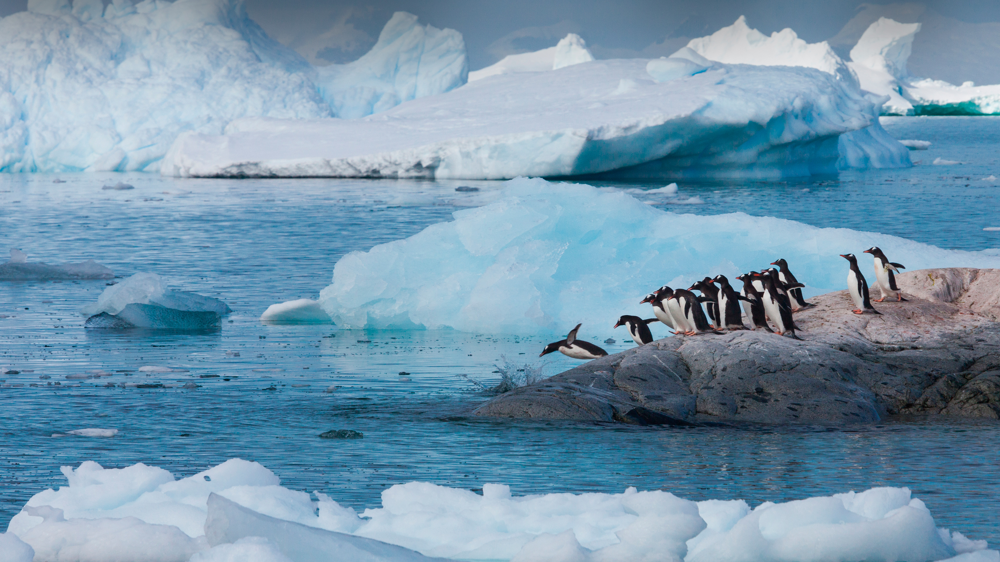

```json
{
  "images": [
    {
      "startdate": "20231004",
      "fullstartdate": "202310041600",
      "enddate": "20231005",
      "url": "/th?id=OHR.GentooJump_ZH-CN9625511393_UHD.jpg&rf=LaDigue_UHD.jpg&pid=hp&w=3840&h=2160&rs=1&c=4",
      "urlbase": "/th?id=OHR.GentooJump_ZH-CN9625511393",
      "copyright": "巴布亚企鹅，南极洲 (© Art Wolfe/Getty Images)",
      "copyrightlink": "/search?q=%e5%b7%b4%e5%b8%83%e4%ba%9a%e4%bc%81%e9%b9%85&form=hpcapt&mkt=zh-cn",
      "title": "这是怎么做到的！",
      "quiz": "/search?q=Bing+homepage+quiz&filters=WQOskey:%22HPQuiz_20231004_GentooJump%22&FORM=HPQUIZ",
      "wp": true,
      "hsh": "42d6059502ec7b4c316b8dec5ef90fd6",
      "drk": 1,
      "top": 1,
      "bot": 1,
      "hs": []
    }
  ],
  "tooltips": {
    "loading": "正在加载...",
    "previous": "上一个图像",
    "next": "下一个图像",
    "walle": "此图片不能下载用作壁纸。",
    "walls": "下载今日美图。仅限用作桌面壁纸。"
  }
}
```
