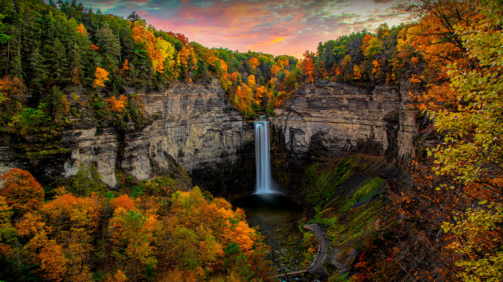

```json
{
  "images": [
    {
      "startdate": "20231005",
      "fullstartdate": "202310051600",
      "enddate": "20231006",
      "url": "/th?id=OHR.TaughannockFalls_ZH-CN4580750386_UHD.jpg&rf=LaDigue_UHD.jpg&pid=hp&w=3840&h=2160&rs=1&c=4",
      "urlbase": "/th?id=OHR.TaughannockFalls_ZH-CN4580750386",
      "copyright": "杜鲁门斯堡的州立托格汉诺克瀑布公园，纽约州，美国 (© Paul Massie Photography/Getty Images)",
      "copyrightlink": "/search?q=%e6%89%98%e6%a0%bc%e6%b1%89%e8%af%ba%e5%85%8b%e7%80%91%e5%b8%83&form=hpcapt&mkt=zh-cn",
      "title": "大自然的威严",
      "quiz": "/search?q=Bing+homepage+quiz&filters=WQOskey:%22HPQuiz_20231005_TaughannockFalls%22&FORM=HPQUIZ",
      "wp": true,
      "hsh": "1f849af8da821a35de213be5babf815c",
      "drk": 1,
      "top": 1,
      "bot": 1,
      "hs": []
    }
  ],
  "tooltips": {
    "loading": "正在加载...",
    "previous": "上一个图像",
    "next": "下一个图像",
    "walle": "此图片不能下载用作壁纸。",
    "walls": "下载今日美图。仅限用作桌面壁纸。"
  }
}
```
