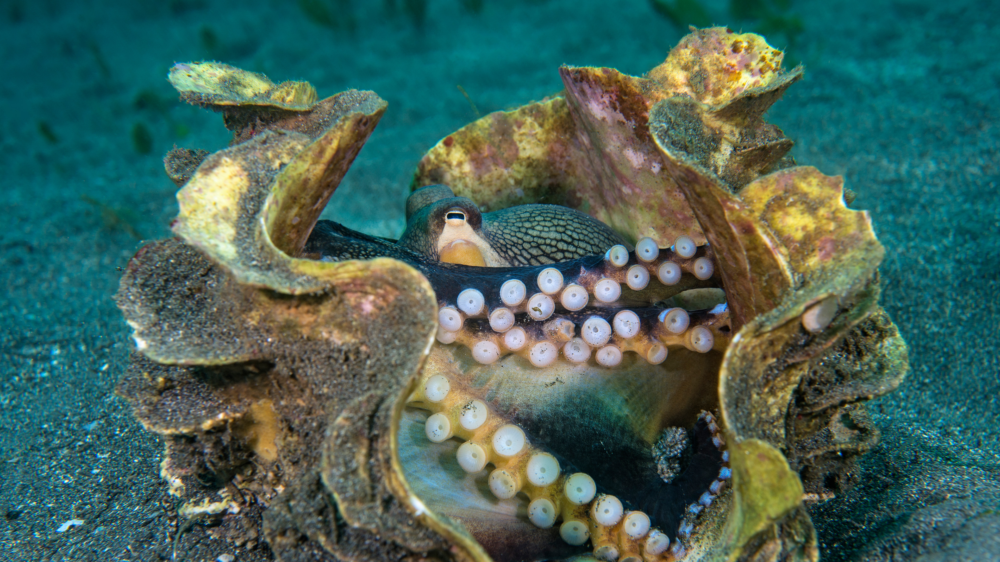

```json
{
  "images": [
    {
      "startdate": "20231007",
      "fullstartdate": "202310071600",
      "enddate": "20231008",
      "url": "/th?id=OHR.OctoClam_ZH-CN5427646548_UHD.jpg&rf=LaDigue_UHD.jpg&pid=hp&w=3840&h=2160&rs=1&c=4",
      "urlbase": "/th?id=OHR.OctoClam_ZH-CN5427646548",
      "copyright": "巨型蛤壳中的条纹蛸，苏拉威西海，印度尼西亚 (© Alex Mustard/Minden Pictures)",
      "copyrightlink": "/search?q=%e4%b8%96%e7%95%8c%e7%ab%a0%e9%b1%bc%e6%97%a5&form=hpcapt&mkt=zh-cn",
      "title": "贝壳庇护所",
      "quiz": "/search?q=Bing+homepage+quiz&filters=WQOskey:%22HPQuiz_20231007_OctoClam%22&FORM=HPQUIZ",
      "wp": true,
      "hsh": "f5d0bce7a829e1a5a9a52d719b356e36",
      "drk": 1,
      "top": 1,
      "bot": 1,
      "hs": []
    }
  ],
  "tooltips": {
    "loading": "正在加载...",
    "previous": "上一个图像",
    "next": "下一个图像",
    "walle": "此图片不能下载用作壁纸。",
    "walls": "下载今日美图。仅限用作桌面壁纸。"
  }
}
```
