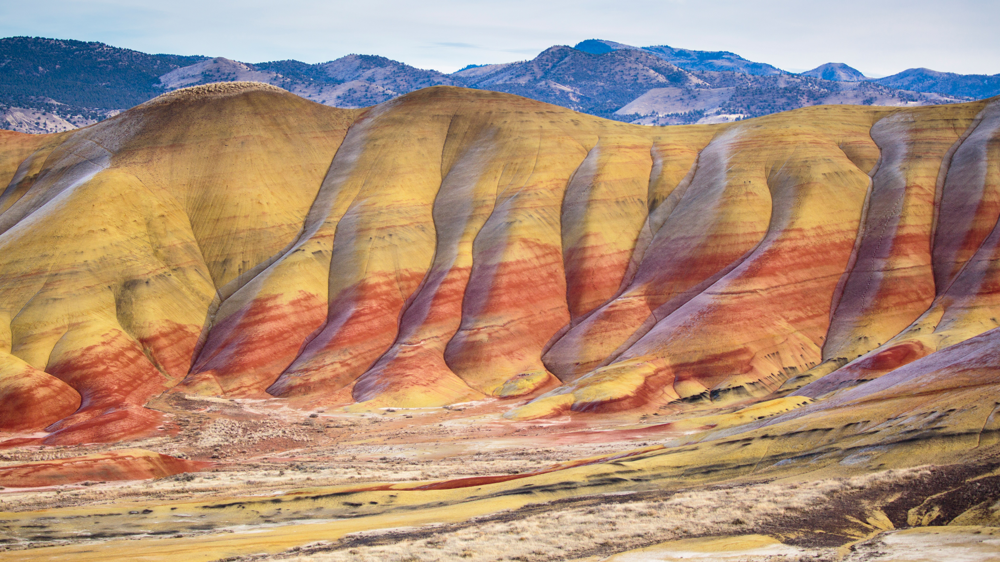

```json
{
  "images": [
    {
      "startdate": "20231010",
      "fullstartdate": "202310101600",
      "enddate": "20231011",
      "url": "/th?id=OHR.JohnDayFossil_ZH-CN6265838332_UHD.jpg&rf=LaDigue_UHD.jpg&pid=hp&w=3840&h=2160&rs=1&c=4",
      "urlbase": "/th?id=OHR.JohnDayFossil_ZH-CN6265838332",
      "copyright": "约翰迪化石床国家纪念地中的彩绘山，俄勒冈州，美国 (© Ben Herndon/Tandem Stills + Motion)",
      "copyrightlink": "/search?q=%e5%bd%a9%e7%bb%98%e5%b1%b1&form=hpcapt&mkt=zh-cn",
      "title": "消失的回声",
      "quiz": "/search?q=Bing+homepage+quiz&filters=WQOskey:%22HPQuiz_20231010_JohnDayFossil%22&FORM=HPQUIZ",
      "wp": true,
      "hsh": "3ea069510aef9000b957858d9292a612",
      "drk": 1,
      "top": 1,
      "bot": 1,
      "hs": []
    }
  ],
  "tooltips": {
    "loading": "正在加载...",
    "previous": "上一个图像",
    "next": "下一个图像",
    "walle": "此图片不能下载用作壁纸。",
    "walls": "下载今日美图。仅限用作桌面壁纸。"
  }
}
```
