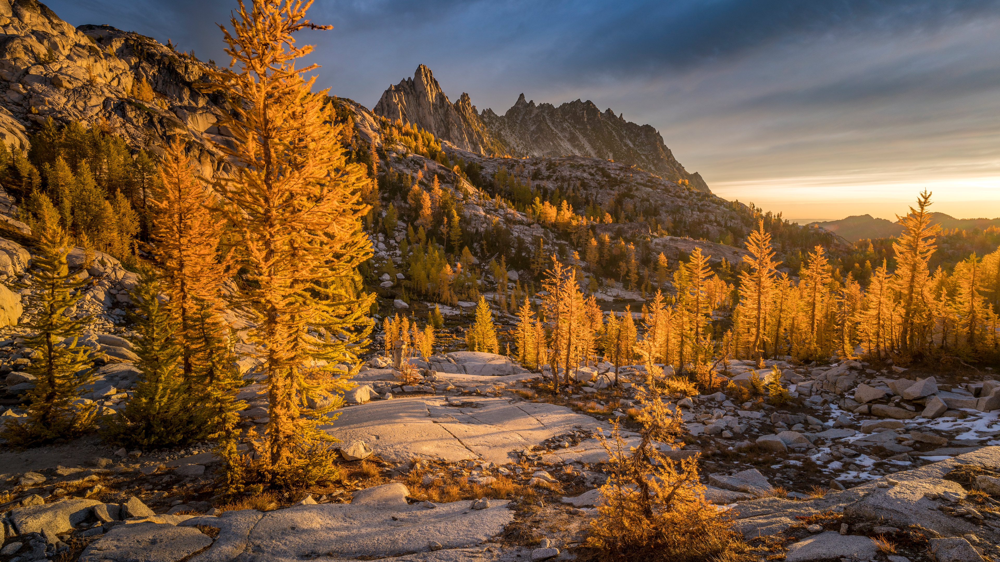

```json
{
  "images": [
    {
      "startdate": "20231015",
      "fullstartdate": "202310151600",
      "enddate": "20231016",
      "url": "/th?id=OHR.GoldenEnchantments_ZH-CN9686531344_UHD.jpg&rf=LaDigue_UHD.jpg&pid=hp&w=3840&h=2160&rs=1&c=4",
      "urlbase": "/th?id=OHR.GoldenEnchantments_ZH-CN9686531344",
      "copyright": "金色落叶松和普鲁西克峰，魔力地带，华盛顿州，美国 (© Jim Patterson/Tandem Stills + Motion)",
      "copyrightlink": "/search?q=%e5%8d%8e%e7%9b%9b%e9%a1%bf%e5%b7%9e&form=hpcapt&mkt=zh-cn",
      "title": "确实令人着迷",
      "quiz": "/search?q=Bing+homepage+quiz&filters=WQOskey:%22HPQuiz_20231015_GoldenEnchantments%22&FORM=HPQUIZ",
      "wp": true,
      "hsh": "e27e8c6bceb3c1f232a338b40253ad56",
      "drk": 1,
      "top": 1,
      "bot": 1,
      "hs": []
    }
  ],
  "tooltips": {
    "loading": "正在加载...",
    "previous": "上一个图像",
    "next": "下一个图像",
    "walle": "此图片不能下载用作壁纸。",
    "walls": "下载今日美图。仅限用作桌面壁纸。"
  }
}
```
