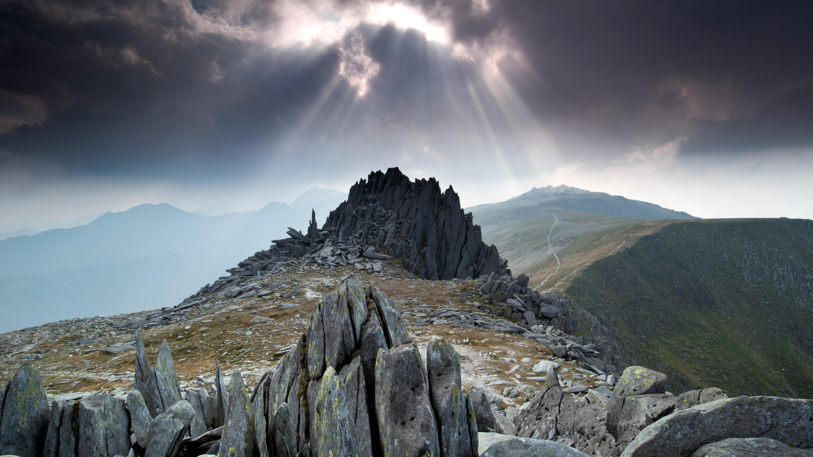

```json
{
  "images": [
    {
      "startdate": "20231018",
      "fullstartdate": "202310181600",
      "enddate": "20231019",
      "url": "/th?id=OHR.CastellyGwyntUK_ZH-CN1219668479_UHD.jpg&rf=LaDigue_UHD.jpg&pid=hp&w=3840&h=2160&rs=1&c=4",
      "urlbase": "/th?id=OHR.CastellyGwyntUK_ZH-CN1219668479",
      "copyright": "Castell y Gwynt，格莱德法赫山，雪墩山国家公园，英国北威尔士 (© Alan Novelli/Alamy Stock Photo)",
      "copyrightlink": "/search?q=Castell+y+Gwynt+Wales&form=hpcapt&mkt=zh-cn",
      "title": "去而复返",
      "quiz": "/search?q=Bing+homepage+quiz&filters=WQOskey:%22HPQuiz_20231018_CastellyGwyntUK%22&FORM=HPQUIZ",
      "wp": true,
      "hsh": "a63d7b900df635a4c6f80f5ab0a95ded",
      "drk": 1,
      "top": 1,
      "bot": 1,
      "hs": []
    }
  ],
  "tooltips": {
    "loading": "正在加载...",
    "previous": "上一个图像",
    "next": "下一个图像",
    "walle": "此图片不能下载用作壁纸。",
    "walls": "下载今日美图。仅限用作桌面壁纸。"
  }
}
```
