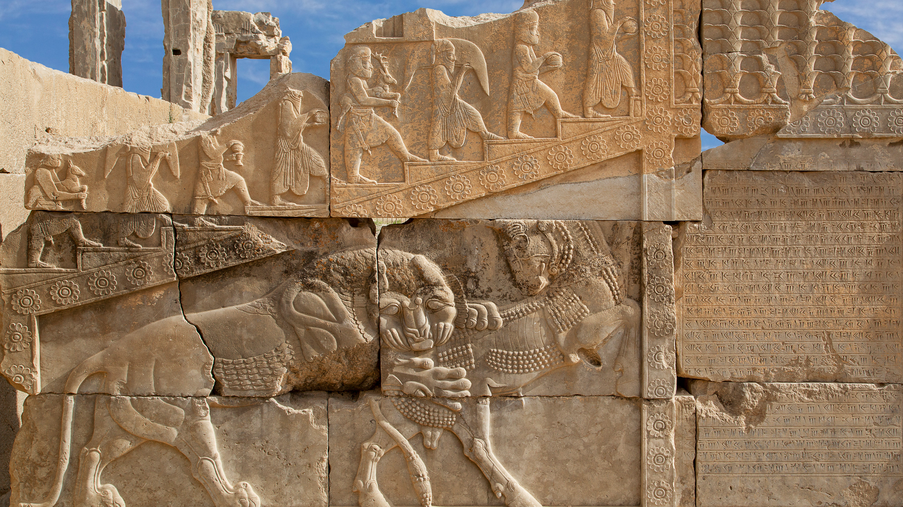

```json
{
  "images": [
    {
      "startdate": "20231020",
      "fullstartdate": "202310201600",
      "enddate": "20231021",
      "url": "/th?id=OHR.PersepolisRelief_ZH-CN4910990690_UHD.jpg&rf=LaDigue_UHD.jpg&pid=hp&w=3840&h=2160&rs=1&c=4",
      "urlbase": "/th?id=OHR.PersepolisRelief_ZH-CN4910990690",
      "copyright": "波斯古城波斯波利斯的浮雕，伊朗 (© Ozbalci/Getty Images)",
      "copyrightlink": "/search?q=%e6%b3%a2%e6%96%af%e6%b3%a2%e5%88%a9%e6%96%af&form=hpcapt&mkt=zh-cn",
      "title": "哇，真是松了一口气！",
      "quiz": "/search?q=Bing+homepage+quiz&filters=WQOskey:%22HPQuiz_20231020_PersepolisRelief%22&FORM=HPQUIZ",
      "wp": true,
      "hsh": "8527018ee72cff570651881dacbae0c0",
      "drk": 1,
      "top": 1,
      "bot": 1,
      "hs": []
    }
  ],
  "tooltips": {
    "loading": "正在加载...",
    "previous": "上一个图像",
    "next": "下一个图像",
    "walle": "此图片不能下载用作壁纸。",
    "walls": "下载今日美图。仅限用作桌面壁纸。"
  }
}
```
