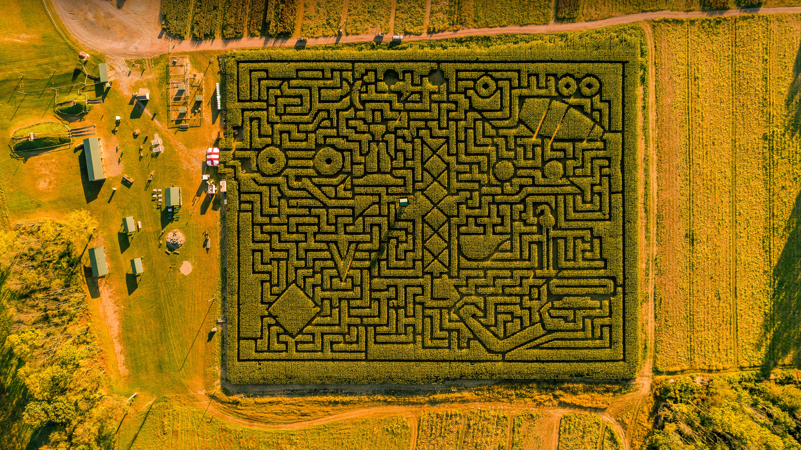

```json
{
  "images": [
    {
      "startdate": "20231022",
      "fullstartdate": "202310221600",
      "enddate": "20231023",
      "url": "/th?id=OHR.PoconosMaze_ZH-CN4696904367_UHD.jpg&rf=LaDigue_UHD.jpg&pid=hp&w=3840&h=2160&rs=1&c=4",
      "urlbase": "/th?id=OHR.PoconosMaze_ZH-CN4696904367",
      "copyright": "塞勒斯堡的玉米迷宫，宾夕法尼亚州，美国 (© Alex Potemkin/Getty Images)",
      "copyrightlink": "/search?q=%e5%ae%be%e5%a4%95%e6%b3%95%e5%b0%bc%e4%ba%9a%e5%b7%9e&form=hpcapt&mkt=zh-cn",
      "title": "“迷”人之境",
      "quiz": "/search?q=Bing+homepage+quiz&filters=WQOskey:%22HPQuiz_20231022_PoconosMaze%22&FORM=HPQUIZ",
      "wp": true,
      "hsh": "fd0578102da0423a8c85f525be950cdf",
      "drk": 1,
      "top": 1,
      "bot": 1,
      "hs": []
    }
  ],
  "tooltips": {
    "loading": "正在加载...",
    "previous": "上一个图像",
    "next": "下一个图像",
    "walle": "此图片不能下载用作壁纸。",
    "walls": "下载今日美图。仅限用作桌面壁纸。"
  }
}
```
