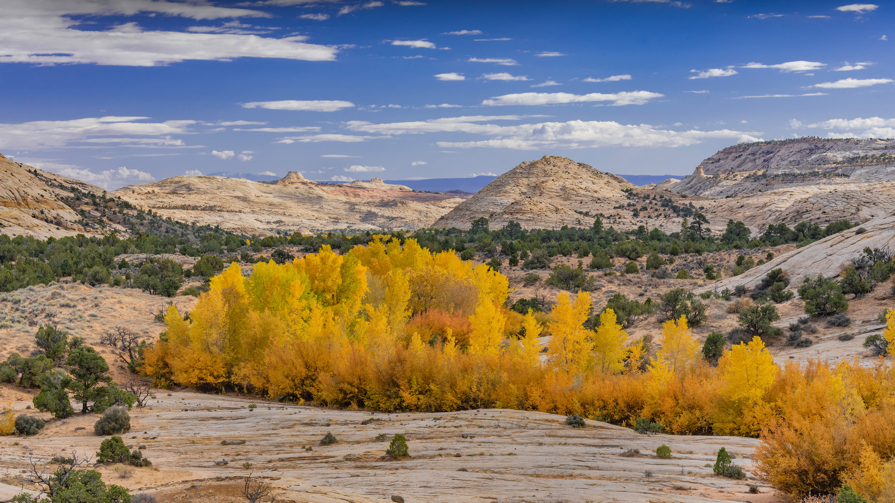

```json
{
  "images": [
    {
      "startdate": "20231024",
      "fullstartdate": "202310241600",
      "enddate": "20231025",
      "url": "/th?id=OHR.GrandStaircase_ZH-CN5928937512_UHD.jpg&rf=LaDigue_UHD.jpg&pid=hp&w=3840&h=2160&rs=1&c=4",
      "urlbase": "/th?id=OHR.GrandStaircase_ZH-CN5928937512",
      "copyright": "大阶梯埃斯卡兰特国家纪念区中的棉白杨树，犹他州，美国 (© Jeff Foott/Minden Pictures)",
      "copyrightlink": "/search?q=%e5%a4%a7%e9%98%b6%e6%a2%af%e5%9f%83%e6%96%af%e5%8d%a1%e5%85%b0%e7%89%b9%e5%9b%bd%e5%ae%b6%e7%ba%aa%e5%bf%b5%e5%8c%ba&form=hpcapt&mkt=zh-cn",
      "title": "秋天的一抹金色",
      "quiz": "/search?q=Bing+homepage+quiz&filters=WQOskey:%22HPQuiz_20231024_GrandStaircase%22&FORM=HPQUIZ",
      "wp": true,
      "hsh": "29566fcd64cf65d220d1b6473e543f29",
      "drk": 1,
      "top": 1,
      "bot": 1,
      "hs": []
    }
  ],
  "tooltips": {
    "loading": "正在加载...",
    "previous": "上一个图像",
    "next": "下一个图像",
    "walle": "此图片不能下载用作壁纸。",
    "walls": "下载今日美图。仅限用作桌面壁纸。"
  }
}
```
