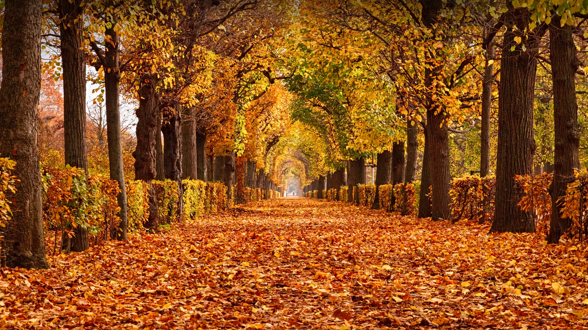

```json
{
  "images": [
    {
      "startdate": "20231025",
      "fullstartdate": "202310251600",
      "enddate": "20231026",
      "url": "/th?id=OHR.ViennaAutumn_ZH-CN7011999199_UHD.jpg&rf=LaDigue_UHD.jpg&pid=hp&w=3840&h=2160&rs=1&c=4",
      "urlbase": "/th?id=OHR.ViennaAutumn_ZH-CN7011999199",
      "copyright": "美泉宫公园的秋叶，维也纳，奥地利 (© rusm/Getty Images)",
      "copyrightlink": "/search?q=%e7%bb%b4%e4%b9%9f%e7%ba%b3%e7%be%8e%e6%b3%89%e5%ae%ab%e5%85%ac%e5%9b%ad&form=hpcapt&mkt=zh-cn",
      "title": "落叶爱好者的天堂",
      "quiz": "/search?q=Bing+homepage+quiz&filters=WQOskey:%22HPQuiz_20231025_ViennaAutumn%22&FORM=HPQUIZ",
      "wp": true,
      "hsh": "ed6bcdbc15ffd90a2e5fdbd1a2c2002e",
      "drk": 1,
      "top": 1,
      "bot": 1,
      "hs": []
    }
  ],
  "tooltips": {
    "loading": "正在加载...",
    "previous": "上一个图像",
    "next": "下一个图像",
    "walle": "此图片不能下载用作壁纸。",
    "walls": "下载今日美图。仅限用作桌面壁纸。"
  }
}
```
