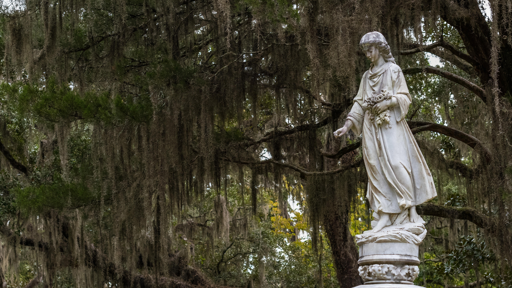

```json
{
  "images": [
    {
      "startdate": "20231028",
      "fullstartdate": "202310281600",
      "enddate": "20231029",
      "url": "/th?id=OHR.SavannahSculpture_ZH-CN7663694208_UHD.jpg&rf=LaDigue_UHD.jpg&pid=hp&w=3840&h=2160&rs=1&c=4",
      "urlbase": "/th?id=OHR.SavannahSculpture_ZH-CN7663694208",
      "copyright": "博纳温彻墓地，萨凡纳，佐治亚州，美国 (© Kelly vanDellen/Alamy)",
      "copyrightlink": "/search?q=%e4%bd%90%e6%b2%bb%e4%ba%9a%e5%b7%9e%e8%90%a8%e5%87%a1%e7%ba%b3&form=hpcapt&mkt=zh-cn",
      "title": "天黑后，你还敢待在这里吗？",
      "quiz": "/search?q=Bing+homepage+quiz&filters=WQOskey:%22HPQuiz_20231028_SavannahSculpture%22&FORM=HPQUIZ",
      "wp": true,
      "hsh": "bb42629281a9642e1143c6429c2f50fb",
      "drk": 1,
      "top": 1,
      "bot": 1,
      "hs": []
    }
  ],
  "tooltips": {
    "loading": "正在加载...",
    "previous": "上一个图像",
    "next": "下一个图像",
    "walle": "此图片不能下载用作壁纸。",
    "walls": "下载今日美图。仅限用作桌面壁纸。"
  }
}
```
