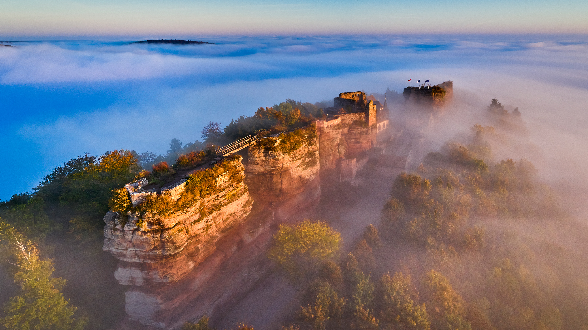

```json
{
  "images": [
    {
      "startdate": "20231031",
      "fullstartdate": "202310311600",
      "enddate": "20231101",
      "url": "/th?id=OHR.HautBarr_ZH-CN8274813404_UHD.jpg&rf=LaDigue_UHD.jpg&pid=hp&w=3840&h=2160&rs=1&c=4",
      "urlbase": "/th?id=OHR.HautBarr_ZH-CN8274813404",
      "copyright": "上巴尔城堡，阿尔萨斯，法国 (© Andrea Pistolesi/Getty Images)",
      "copyrightlink": "/search?q=%e9%98%bf%e5%b0%94%e8%90%a8%e6%96%af%e5%a4%a7%e5%8c%ba&form=hpcapt&mkt=zh-cn",
      "title": "你知道“阿尔萨斯之眼”吗？",
      "quiz": "/search?q=Bing+homepage+quiz&filters=WQOskey:%22HPQuiz_20231031_HautBarr%22&FORM=HPQUIZ",
      "wp": true,
      "hsh": "f25a0002a616bf2817f1096135185293",
      "drk": 1,
      "top": 1,
      "bot": 1,
      "hs": []
    }
  ],
  "tooltips": {
    "loading": "正在加载...",
    "previous": "上一个图像",
    "next": "下一个图像",
    "walle": "此图片不能下载用作壁纸。",
    "walls": "下载今日美图。仅限用作桌面壁纸。"
  }
}
```
