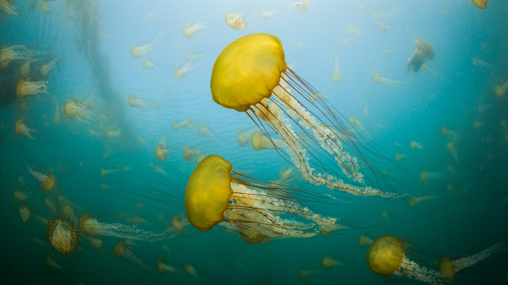

```json
{
  "images": [
    {
      "startdate": "20231102",
      "fullstartdate": "202311021600",
      "enddate": "20231103",
      "url": "/th?id=OHR.SeaNettles_ZH-CN1735729435_UHD.jpg&rf=LaDigue_UHD.jpg&pid=hp&w=3840&h=2160&rs=1&c=4",
      "urlbase": "/th?id=OHR.SeaNettles_ZH-CN1735729435",
      "copyright": "卡梅尔海岸的太平洋海荨麻水母，加利福尼亚，美国 (© Jim Patterson/Tandem Stills + Motion)",
      "copyrightlink": "/search?q=%e6%b5%b7%e8%8d%a8%e9%ba%bb%e6%b0%b4%e6%af%8d&form=hpcapt&mkt=zh-cn",
      "title": "发光的花朵",
      "quiz": "/search?q=Bing+homepage+quiz&filters=WQOskey:%22HPQuiz_20231102_SeaNettles%22&FORM=HPQUIZ",
      "wp": true,
      "hsh": "78be29f172e321818c6c258c75817a68",
      "drk": 1,
      "top": 1,
      "bot": 1,
      "hs": []
    }
  ],
  "tooltips": {
    "loading": "正在加载...",
    "previous": "上一个图像",
    "next": "下一个图像",
    "walle": "此图片不能下载用作壁纸。",
    "walls": "下载今日美图。仅限用作桌面壁纸。"
  }
}
```
